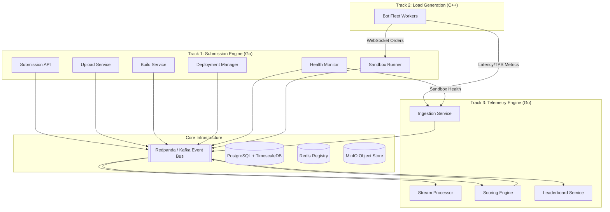

# System Design Document: IICPC Summer Hackathon 2026

## Table of Contents

1. [System Overview & Architecture Philosophy](#1-system-overview--architecture-philosophy)
2. [High-Level Architecture](#2-high-level-architecture)
3. [The Event-Driven State Machine](#3-the-event-driven-state-machine)
4. [Deep Dive: The Submission Lifecycle (Track 1)](#4-deep-dive-the-submission-lifecycle-track-1)
5. [Deep Dive: The Bot Fleet Load Generator (Track 2)](#5-deep-dive-the-bot-fleet-load-generator-track-2)
6. [Deep Dive: Telemetry & Scoring Pipeline (Track 3)](#6-deep-dive-telemetry--scoring-pipeline-track-3)
7. [Inter-Service Communication & Data Flow](#7-inter-service-communication--data-flow)
8. [Data Models & Storage](#8-data-models--storage)
9. [Performance & Scalability Characteristics](#9-performance--scalability-characteristics)
10. [Technology Decisions & Tradeoffs](#10-technology-decisions--tradeoffs)

---

## 1. SYSTEM OVERVIEW & ARCHITECTURE PHILOSOPHY

The IICPC Summer Hackathon 2026 platform is designed to securely evaluate untrusted trading engine code submitted by contestants. It evaluates submissions based on extreme low-latency performance, high throughput, and correctness.

To achieve this, the system is strictly decoupled into three functional "Tracks":
1. **Track 1 (Submission Engine)**: The control plane. It ingests source code, builds it into Docker containers, securely sandboxes them, and monitors their health.
2. **Track 2 (Bot Fleet)**: The load generator. A distributed, highly concurrent C++ system that acts as a swarm of clients, bombarding the sandboxed submission with WebSocket order flow.
3. **Track 3 (Telemetry & Scoring)**: The analytics plane. It consumes immense volumes of metric data from the Bot Fleet, aggregates it in real-time, computes a composite score, and drives a live leaderboard.

**Core Philosophy:**
The platform relies entirely on **Event-Driven Architecture (EDA)** via Redpanda (Kafka). Microservices do not call each other synchronously (e.g., no internal gRPC/REST between services). Instead, they react to state changes published to the event bus. This ensures that if the Build Service crashes, the Submission API remains perfectly functional, simply queueing build requests until the builder recovers.

---

## 2. HIGH-LEVEL ARCHITECTURE

The platform runs as a constellation of microservices grouped by their Track, sharing a common infrastructure layer.

---

## 3. THE EVENT-DRIVEN STATE MACHINE

At the heart of the platform is the **Submission State Machine**, managed within PostgreSQL but driven by Kafka events. When a contestant submits code, it creates a `Submission` record in the database. 

Every microservice in Track 1 acts as a pure function: `Event -> Process -> Event`.

1. **Submission API** receives the request, inserts the record as `CREATED`, and emits `submission.created`.
2. **Upload Service** consumes `submission.created`, generates a presigned S3 URL for the contestant, and emits `submission.uploaded`.
3. **Build Service** consumes `submission.uploaded`, fetches the code, builds the Docker image, pushes build logs to S3, and emits `build.succeeded`.
4. **Deployment Manager** consumes `build.succeeded`, launches the Docker container, maps network ports, and emits `deployment.ready`.
5. **Health Monitor** consumes `deployment.ready` and begins probing the container continuously. If healthy, it emits `health.ready`. If it fails, it emits `health.degraded`.

By reading the Kafka topics, you can perfectly reconstruct the history and state of any contestant's submission.

---

## 4. DEEP DIVE: THE SUBMISSION LIFECYCLE (TRACK 1)

This track is responsible for turning untrusted code into a running, monitored service.

### 4.1 Artifact Management
Instead of piping large source code files through our APIs or Kafka, we use the **Claim Check Pattern**. The API gives the contestant a presigned MinIO (S3) URL. The contestant uploads directly to the storage layer. Kafka events only carry the S3 object URI (`artifact_uri`), keeping the message bus extremely fast and lightweight.

### 4.2 Sandboxed Execution
Once built, the `deployment-manager` instructs the `docker` orchestrator to spin up the container. 
* **Networking**: Containers are placed on a locked-down bridge network (`track1-sandbox-net`). They cannot reach the internet; they can only be reached by the Bot Fleet.
* **Endpoint Registration**: The orchestrator binds the container's `declared_port` to a random host port. This mapped `InternalURL` is registered in Redis, allowing the Bot Fleet to discover where to send traffic.
* **Resource Limits**: The container is strictly bound to 512MB RAM and 1 CPU core to ensure all contestants are evaluated on an equal playing field. The root filesystem is marked read-only.

### 4.3 Health Monitoring
The `health-monitor` runs a continuous background loop for every active deployment. It connects to the `InternalURL` via HTTP or TCP every 5 seconds. If the submission crashes or stops responding to network requests, the monitor updates the Postgres state and triggers a teardown, ensuring broken code is quickly evicted from the system.

---

## 5. DEEP DIVE: THE BOT FLEET LOAD GENERATOR (TRACK 2)

Once a submission reaches the `READY` state, Track 2 takes over.

### 5.1 Architecture & Concurrency
The Bot Fleet is written in C++20 to achieve brutal efficiency. It uses a **Thread-per-Core** model powered by Boost.Asio and C++ coroutines. 
* Rather than spawning OS threads for every bot, the fleet multiplexes thousands of bot connections over a small pool of worker threads.
* Each bot runs independently, simulating different market behaviors (e.g., market makers providing liquidity, momentum traders aggressively crossing the spread).

### 5.2 Metric Collection (Lock-Free)
Because latency is the primary scoring metric, the measurement code itself cannot introduce latency. 
* Bots record their request-response times using thread-local High Dynamic Range (HDR) histograms. 
* Once per second, the fleet aggregates these histograms and POSTs a highly-compressed summary (Tumbling Window) to Track 3. This avoids DDOSing our own telemetry ingestion with millions of individual request logs.

---

## 6. DEEP DIVE: TELEMETRY & SCORING PIPELINE (TRACK 3)

Track 3 handles the high-volume firehose of metrics coming from the Bot Fleet and translates them into a public leaderboard.

### 6.1 Ingestion & Routing
The `ingestion-service` acts as the boundary. It accepts HTTP and WebSocket connections, validates the payload structure, wraps it in a standard `Envelope`, and stamps it with an ingest timestamp. It immediately places the envelope on the `telemetry.bot_metrics` Kafka topic.

### 6.2 Stream Processing (The Windowing Engine)
The `stream-processor` consumes the raw metric topics. To provide both real-time dashboards and durable scoring, it calculates three distinct types of time windows using a lock-free slot ring:
1. **Tumbling Windows** (e.g., exactly 00:00:00 to 00:00:05). These are authoritative, non-overlapping chunks. They are persisted durably into PostgreSQL/TimescaleDB (`window_aggregates`).
2. **Sliding Windows** (e.g., the last 5 seconds, updated every 1 second). These are transient and used to drive ultra-smooth live charts on the frontend.
3. **Rolling Windows** (e.g., the entire lifetime of the run). This calculates global metrics like peak TPS and total errors (`rolling_stats`).

### 6.3 Composite Scoring
The `scoring-engine` watches the stream of tumbling windows. It evaluates each window against four absolute axes:
* **Latency (35%)**: Scored on a logarithmic curve, penalizing high tail-latency (P99).
* **Throughput (30%)**: Linear scaling based on successful Transactions Per Second (TPS).
* **Correctness (25%)**: Ratio of valid vs invalid trade executions.
* **Stability (10%)**: Heavily penalizes error rates and TPS variance (jitter).

### 6.4 The Real-Time Leaderboard
The `leaderboard-service` consumes the `analytics.scores` topic. 
* Every replica of the leaderboard service joins Kafka using a **unique consumer group**. This is a deliberate architectural choice: it means every replica sees the *entire* stream of scores.
* Because every replica holds the full state in local memory, when a user connects via WebSocket, the service can broadcast leaderboard updates instantly without ever querying the database.
* To survive restarts, the state is mirrored to a Redis Sorted Set (`ZSET`).

---

## 7. INTER-SERVICE COMMUNICATION & DATA FLOW

The system heavily relies on strict boundaries between synchronous and asynchronous communication.

**Synchronous (HTTP/REST/WS)**:
* Contestant -> Submission API (Metadata upload)
* Contestant -> MinIO (Direct Artifact S3 Upload)
* Bot Fleet -> Ingestion Service (Pushing Metrics)
* Frontend -> Leaderboard Service (WebSocket Subscription)

**Asynchronous (Kafka / Redpanda)**:
All service-to-service orchestration happens via Kafka.

| Topic | Producer | Consumer | Purpose |
|---|---|---|---|
| `submission.events` | Submission API, Upload Service | Build Service | Triggers artifact builds |
| `build.events` | Build Service | Deployment Manager | Triggers container launch |
| `deployment.events` | Deployment Manager | Health Monitor | Starts active probing |
| `telemetry.bot_metrics` | Ingestion Service | Stream Processor | Raw load-test data |
| `analytics.window_aggregates`| Stream Processor | Scoring Engine | Chunked time-series data |
| `analytics.scores` | Scoring Engine | Leaderboard Service | Final graded performance |

---

## 8. DATA MODELS & STORAGE

The platform uses specific datastores tailored to the access patterns of the data.

### 8.1 PostgreSQL (State & Metadata)
Used for data that requires strong consistency, foreign keys, and relational querying.
* `submissions`: Core metadata (ID, language, status, declared_port).
* `deployments`: Maps a submission to its orchestrator identity.
* `endpoints`: Network routing information (InternalURL).

### 8.2 TimescaleDB (Time-Series Analytics)
A PostgreSQL extension used for high-volume append-only data.
* `window_aggregates`: A hypertable storing the 5-second tumbling windows (TPS, P99 latency, errors).
* `sandbox_samples`: A hypertable storing physical resource utilization (CPU, Memory, OOM kills) of the sandboxed containers.

### 8.3 Redis (High-Speed Read Models)
Used for ephemeral routing and ultra-fast leaderboard queries.
* `endpoints:v1`: A registry used by the Bot Fleet to instantly look up the host IP/Port of a contestant's sandbox.
* `leaderboard:{run_id}`: A Sorted Set ranking submissions by their composite score.

### 8.4 MinIO (Blob Storage)
Used for large binary blobs to keep Kafka and Postgres small and fast.
* `raw-uploads`: Tarballs of contestant source code.
* `build-logs`: Complete stdout/stderr of the Docker build process for debugging.

---

## 9. PERFORMANCE & SCALABILITY CHARACTERISTICS

* **Kafka Decoupling**: Because microservices only interact with Kafka, the platform easily survives traffic spikes. If 1,000 contestants upload code simultaneously, the Build Service simply churns through the Kafka topic at its maximum configured concurrency without dropping requests.
* **Bot Fleet Efficiency**: By utilizing thread-per-core architectures and minimizing locks (using `SeqLock` for simulator state sync), the C++ bots can saturate the contestant's network stack using minimal resources.
* **Pre-Aggregation**: The Bot Fleet aggregates individual request metrics into HDR histograms client-side. It sends *one* payload per second per worker, rather than thousands of raw HTTP requests. This protects Track 3's ingestion service from being DDOSed by Track 2.
* **In-Memory Fan-Out**: The Leaderboard Service serves thousands of connected WebSocket clients directly from RAM, making it highly resilient to read-heavy traffic.

---

## 10. TECHNOLOGY DECISIONS & TRADEOFFS

* **Go (Golang)**: Chosen for all control-plane and telemetry microservices. Its built-in concurrency model, rich Kafka ecosystem (`segmentio/kafka-go`), and extremely fast startup times make it ideal for building the event-driven backbone.
* **C++20**: Chosen exclusively for the Bot Fleet. When measuring microsecond-level latency percentiles, garbage collection pauses (like those in Go or Java) would pollute the metrics. C++ allows precise control over memory allocations on the hot path.
* **Redpanda**: Chosen over Apache Kafka. It drops the JVM and ZooKeeper dependencies, compiling to a single native binary. It runs flawlessly inside local Docker Compose environments while maintaining exact Kafka protocol compatibility.
* **Docker Engine API**: For the Hackathon environment, we orchestrate directly against `/var/run/docker.sock` rather than deploying a full Kubernetes cluster. 
  * *Tradeoff*: This provides a vastly superior developer experience for local testing via `docker-compose`. However, transitioning to a production cloud environment requires writing a new Kubernetes orchestrator implementation.
