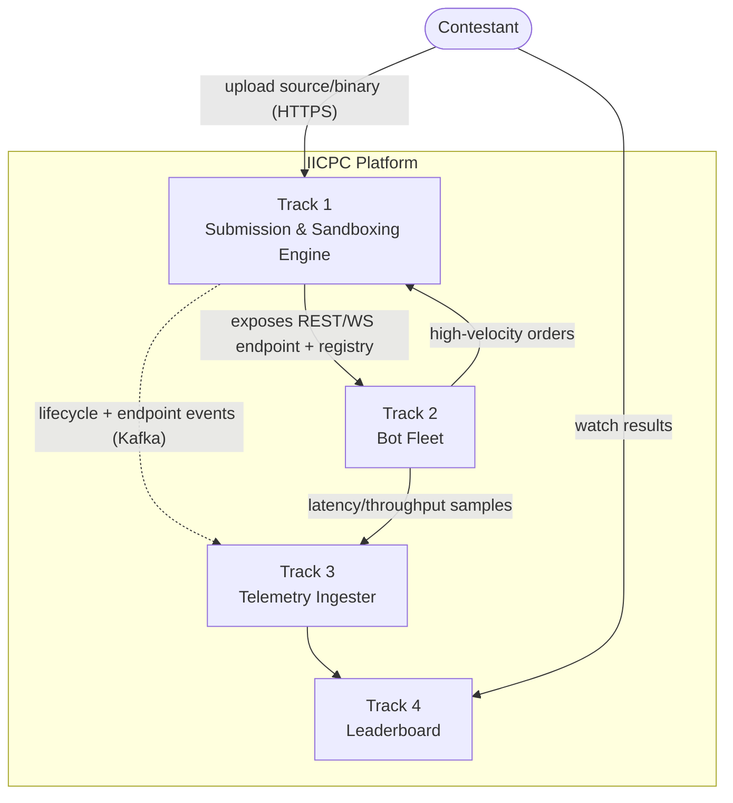
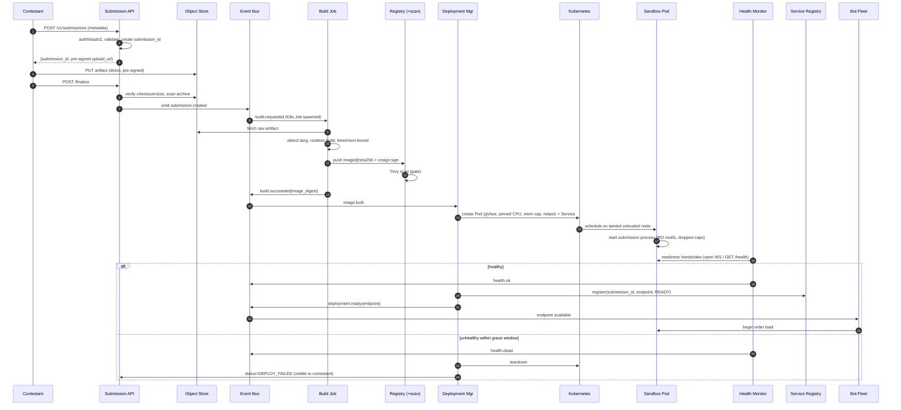
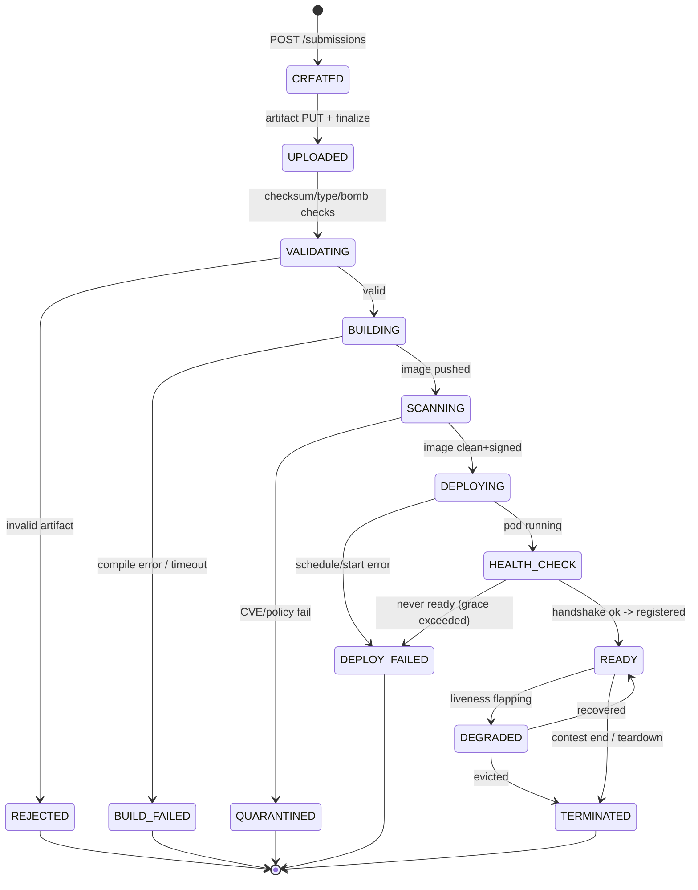

# Track 1 — Submission & Sandboxing Engine
## Deliverable 1: Architecture Document

> **Scope:** This document designs the production-grade architecture for Track 1 of the
> IICPC Summer Hackathon 2026 platform. Track 1 accepts contestant submissions
> (C++ / Rust / Go source **or** prebuilt binaries), builds them, packages them into
> hardened container images, deploys them into strictly isolated sandboxes with CPU
> pinning / memory limits / network isolation, and exposes the resulting REST or
> WebSocket endpoint so the **Bot Fleet (Track 2)** can stress-test it and the
> **Telemetry Ingester (Track 3)** can measure it.

---

## 1. Design Goals & Non-Goals

### 1.1 Goals
| # | Goal | Driver |
|---|------|--------|
| G1 | **Untrusted code is contained.** A malicious submission must not escape its sandbox, reach the control plane, attack other submissions, or exfiltrate data. | Spec: "prevent malicious code execution" |
| G2 | **Fair, deterministic resource allocation.** Every submission gets identical, pinned CPU and capped memory so latency numbers are comparable. | Spec: "CPU pinning, strict memory limits" |
| G3 | **Hands-off build & deploy.** Upload → running endpoint with zero human steps. | Spec: "automatically build and deploy" |
| G4 | **Stable, discoverable endpoints.** Track 2/3 must reliably find and connect to each submission's endpoint. | Integration contract |
| G5 | **Horizontal scalability.** Hundreds of submissions can be built/hosted concurrently across a cluster. | Spec: "scaled horizontally" |
| G6 | **Full auditability.** Every state change is logged immutably for scoring disputes and forensics. | Fairness + security |

### 1.2 Non-Goals (owned by other tracks)
- Generating load (Track 2 — Bot Fleet).
- Measuring latency/throughput/correctness (Track 3 — Telemetry Ingester).
- Rendering the leaderboard (Track 4).
- Track 1 **publishes** endpoint metadata and lifecycle events those tracks consume; it does not compute scores.

### 1.3 Key Principles
1. **Control plane vs. data plane separation.** Our trusted services (the control plane) never share a kernel, namespace, or node-trust boundary with untrusted submission containers (the data plane).
2. **Defense in depth.** No single mechanism is trusted. Namespaces + cgroups v2 + seccomp + AppArmor + capability dropping + rootless + a userspace kernel (gVisor) are layered so that one bypass is not a breach (detailed in Deliverable 3).
3. **Everything is an event.** State transitions emit events to a log (Redpanda/Kafka). This decouples services and gives Track 3/4 a clean integration surface.
4. **Immutable artifacts.** A submission is built **once** into a content-addressed image; the same digest is deployed, scanned, and (if needed) re-deployed. No rebuilds drift.

---

## 2. Component Catalog

Each component below lists **what it is**, **why it exists**, **its interface**, and **how it fails safe**.

### 2.1 Submission API (Gateway)
- **What:** The single public HTTPS entrypoint. A stateless REST/gRPC service behind the Ingress/Load Balancer. Authenticates the contestant, validates the request envelope, issues a `submission_id`, returns a pre-signed upload URL, and exposes status/endpoint lookup.
- **Why it exists:** One authenticated, rate-limited, audited front door. Keeps every other service private (cluster-internal only). It is the trust boundary between the internet and the platform.
- **Interface (representative):**
  - `POST /v1/submissions` → `{submission_id, upload_url, expires_at}`
  - `PUT  <upload_url>` (pre-signed, goes straight to object storage)
  - `POST /v1/submissions/{id}/finalize` → triggers the pipeline
  - `GET  /v1/submissions/{id}` → `{status, phase, endpoint?, error?}`
  - `GET  /v1/submissions/{id}/logs` → streamed build/runtime logs (sanitized)
- **Failure handling:** Stateless and replicated (≥3 replicas); any replica can serve any request because all state lives in the Metadata DB. Rejects oversized/invalid requests at the edge. Rate-limits per contestant to prevent upload floods.
- **Security:** TLS termination, authN (API token / OIDC), authZ (a contestant sees only their own submissions), strict request-size caps, input schema validation, WAF-style filtering.

### 2.2 Upload Service
- **What:** Logic that issues **pre-signed, time-boxed, single-use** upload URLs and verifies completed uploads (size, checksum, MIME/type sniffing, archive-bomb checks). May be a module of the Submission API or a small dedicated service.
- **Why it exists:** Large artifacts (binaries, source tarballs) must **not** stream through application pods — that wastes control-plane memory/bandwidth and creates a DoS vector. Pre-signed URLs push bytes directly into object storage. The platform only handles small metadata.
- **Interface:** `issueUploadUrl(submission_id, declared_size, content_type)`, `verifyUpload(submission_id)` (HEAD object, compare checksum/size to declared values).
- **Failure handling:** Upload URLs expire (e.g. 15 min); abandoned uploads are garbage-collected. A checksum/size mismatch fails the submission before any compute is spent.
- **Security:** URLs are scoped to exactly one object key and one HTTP verb. Decompression is bounded (max ratio + max output size) to stop **zip bombs**. No execution happens here.

### 2.3 Artifact Storage
- **What:** S3-compatible object store (AWS S3 / GCS / MinIO) holding three artifact classes in separate buckets/prefixes:
  1. **Raw uploads** (contestant source/binary) — write-once, server-side encrypted.
  2. **Build outputs / logs** — produced by the Build Service.
  3. **Container image layers** — actually pushed to a **container registry** (see 2.11), which is conceptually part of artifact storage.
- **Why it exists:** Durable, cheap, horizontally scalable blob storage decoupled from compute. Lets builders and the registry be stateless and ephemeral.
- **Interface:** S3 API (`PutObject`, `GetObject`, `HeadObject`), lifecycle rules for TTL cleanup.
- **Failure handling:** Multi-AZ durability from the provider. Versioning on the raw bucket so an upload can't be silently overwritten. Lifecycle policy auto-deletes artifacts after the contest window.
- **Security:** Encryption at rest (SSE-KMS), bucket policies that deny public access, per-prefix IAM so a builder pod can read only the one submission it is assigned, object-lock/WORM on audit-relevant artifacts.

### 2.4 Build Service
- **What:** Converts a raw submission into a runnable, content-addressed **container image**. Runs as a **Kubernetes Job per submission** (ephemeral). Detects language/build system, selects a pinned, hardened base image, builds inside an **unprivileged, isolated builder** (Kaniko / BuildKit-rootless / `img`), and pushes the resulting image to the registry by digest.
- **Why it exists:** Building untrusted code is itself dangerous (build scripts run arbitrary code). It must be isolated, resource-limited, time-boxed, and reproducible. Doing it as an ephemeral Job gives natural per-submission isolation and clean teardown.
- **Inputs:** raw artifact + detected manifest (e.g. `CMakeLists.txt`, `Cargo.toml`, `go.mod`, or a declared `Dockerfile` / "binary-only" mode).
- **Outputs:** `image_digest` (e.g. `registry/...@sha256:...`), build log, build status event.
- **Failure handling:** Hard wall-clock timeout (e.g. 5–10 min), memory/CPU caps on the Job, no network egress except the registry and base-image mirror, automatic retry with backoff on **infrastructure** failures (not on compilation errors — those are terminal and reported to the contestant).
- **Security:** **Rootless** build, no Docker-socket mounting (that would be a host breakout), network policy restricting egress, base images pinned by digest and pre-scanned, build cache namespaced per submission to avoid cross-contamination.

### 2.5 Container Orchestrator
- **What:** **Kubernetes** — the substrate that schedules builder Jobs and sandbox Pods, enforces resource requests/limits, handles bin-packing, node selection, restarts, and scaling.
- **Why it exists:** We need a battle-tested scheduler with first-class support for cgroups, namespaces, network policies, RBAC, quotas, and a declarative API. Re-implementing this is out of scope and unwise.
- **Interface:** Kubernetes API (Deployments, Jobs, Pods, Services, NetworkPolicies, ResourceQuotas, RuntimeClasses). Driven by the Deployment Manager via the API, not by humans.
- **Failure handling:** Self-healing (reschedules failed Pods), node draining, `PodDisruptionBudgets` for control-plane services. Sandbox Pods are `restartPolicy: Never`-style ephemeral and are recreated by the Deployment Manager, not silently.
- **Security:** RBAC least-privilege per service account, dedicated node pools for untrusted workloads, `RuntimeClass` selecting a sandboxed runtime (gVisor/Kata), admission control (OPA Gatekeeper / Kyverno) to reject any Pod that doesn't meet the hardened spec.

### 2.6 Sandbox Runtime
- **What:** The actual isolation technology each submission container runs under: a **sandboxed container runtime** — primarily **gVisor (runsc)** as a userspace kernel, optionally **Kata Containers** (microVM) for stronger isolation — combined with rootless execution, dropped capabilities, seccomp, AppArmor, read-only rootfs, and cgroups v2 limits.
- **Why it exists:** A standard `runc` container shares the host kernel; a single kernel vulnerability = full host compromise. Because we explicitly assume **malicious binaries**, we interpose a second kernel boundary (gVisor) or a VM boundary (Kata). This is the crux of "strictly isolated."
- **Interface:** Selected via Kubernetes `RuntimeClass` (`runtimeClassName: gvisor`). Transparent to the workload.
- **Failure handling:** If the runtime fails to start the sandbox, the Pod fails fast and the Deployment Manager marks the submission `DEPLOY_FAILED` (no fallback to an unsafe runtime — **fail closed**).
- **Security:** Full treatment in Deliverable 3. Summary: each sandbox gets its own PID/network/mount/IPC/UTS/user namespaces, a dropped capability set, a deny-by-default seccomp profile, an AppArmor profile, a read-only root filesystem, and hard cgroup limits.

### 2.7 Deployment Manager
- **What:** The **stateful orchestration brain** of Track 1. A controller that consumes "image ready" events and drives a submission through deploy → health-gate → register → (later) teardown. Implements the per-submission state machine and reconciles desired vs. actual Kubernetes state.
- **Why it exists:** Kubernetes provides primitives; *something* must encode our policy: which node pool, which RuntimeClass, which CPU set to pin, what memory cap, when to consider a submission "ready", when to tear it down. Centralizing this avoids scattering policy across scripts.
- **Inputs:** `image.built` event (`submission_id`, `image_digest`).
- **Outputs:** A sandbox Pod + Service, a `deployment.ready` / `deployment.failed` event, and a Service Registry entry.
- **Failure handling:** Reconciliation loop (like a K8s controller) — if a sandbox dies, it either recreates it or marks the submission failed per policy; idempotent so retries are safe. Uses leader election for HA.
- **Security:** Holds a scoped K8s service account that can create resources **only** in the untrusted namespace; cannot touch control-plane namespaces.

### 2.8 Health Monitoring
- **What:** Liveness/readiness probing + continuous health/resource watching of each sandbox. Combines Kubernetes probes (configured by the Deployment Manager) with an active health-check that performs a protocol-level handshake (open the WebSocket / hit the REST health route) before the endpoint is published.
- **Why it exists:** Track 2 must never be pointed at an endpoint that isn't actually accepting orders. A submission that compiles and "starts" but never binds its port must not enter the leaderboard as "ready." Health gating guarantees only genuinely-serving endpoints are registered.
- **Interface:** `GET /healthz` (platform-injected sidecar/probe), readiness gate on the protocol handshake; emits `health.ok` / `health.degraded` / `health.dead` events.
- **Failure handling:** Readiness failures keep the endpoint **out** of the registry. Repeated liveness failures trigger restart-or-evict policy and a `deployment.unhealthy` event so Track 3/4 can annotate results.
- **Security:** Probes run from the platform side; the submission cannot forge "healthy." Probe traffic is isolated to the platform→sandbox path.

### 2.9 Service Registry
- **What:** The authoritative, low-latency directory mapping `submission_id` → live endpoint (`host:port`, protocol, status, resource profile). Backed by **Redis** (fast lookups + pub/sub) with the durable source of truth in the Metadata DB; for in-cluster discovery, Kubernetes Services/DNS provide stable virtual IPs.
- **Why it exists:** The Bot Fleet and Telemetry Ingester need a single, reliable place to ask "where is submission X and is it ready?" Decouples consumers from Pod IP churn.
- **Interface:** `register(submission_id, endpoint, protocol, status)`, `lookup(submission_id)`, `list(status=READY)`, plus a pub/sub channel `endpoints.changed`.
- **Failure handling:** Redis replicated (primary + replicas / Sentinel or cluster); registry is rebuildable from the Metadata DB + K8s state if lost (it is a cache/index, not the source of truth).
- **Security:** Internal-only. Consumers authenticate (mTLS / service tokens). Entries appear **only** after health gating.

### 2.10 Metadata Database
- **What:** The **durable system of record** for submissions, builds, deployments, and audit references. **PostgreSQL** (relational integrity, transactions) for entity/state data; the platform's time-series store (**TimescaleDB**, shared with Track 3) holds health/resource samples.
- **Why it exists:** Everything else (registry cache, K8s objects, in-flight events) is reconstructible if and only if we have a transactional record of truth. Powers status APIs, dispute resolution, and idempotent reconciliation.
- **Interface:** SQL. Core tables: `submissions`, `builds`, `deployments`, `endpoints`, `audit_log` (schema in CODING_PLAN.md).
- **Failure handling:** Primary + synchronous replica, PITR backups, migrations versioned. All state transitions are transactional so a crash never leaves a half-applied state.
- **Security:** Encrypted at rest + in transit, least-privilege DB roles per service, no direct access from untrusted workloads (they have no network path to it).

### 2.11 Container Registry *(supporting component within Artifact Storage)*
- **What:** OCI image registry (Harbor / ECR / GCR) storing built submission images by digest, with an integrated **vulnerability scanner** (Trivy/Clair) gate.
- **Why it exists:** Decouples build from deploy; enables content-addressed, scannable, signed images.
- **Security:** Image signing (cosign) + admission policy that only allows signed, scanned images to deploy. This is the **Security Scanning** gate referenced in the workflow.

### 2.12 Logging & Audit Pipeline
- **What:** Two streams: (a) **operational logs/metrics** (Fluent Bit → Loki/Elasticsearch; Prometheus for metrics) for the platform's own observability, and (b) an **immutable audit log** of security-relevant events (who uploaded what, every build, every deploy, every policy decision, every teardown) written append-only to object storage with object-lock.
- **Why it exists:** Fairness disputes ("my submission was throttled"), security forensics ("did a sandbox try to escape"), and operational debugging all require trustworthy history. Audit must be tamper-evident and separate from app logs.
- **Interface:** Structured JSON log lines + an `audit.*` event topic; Grafana/Kibana dashboards; alert rules.
- **Failure handling:** Buffered shippers (no log loss on transient outages), backpressure handling, retention policies.
- **Security:** Audit stream is append-only/WORM; logs are scrubbed of secrets; submission stdout/stderr is treated as untrusted text (sanitized before display to prevent log-injection/terminal-escape attacks).

---

## 3. System Context & Component Map

### 3.1 C4 Level 1 — System Context



**Track 1's external contracts:**
- **Inbound:** contestant uploads.
- **Outbound to Track 2/3:** Service Registry entries + `deployment.*` / `endpoint.*` events.
- **Inbound from Track 2:** order traffic hits the *sandboxed submission*, not our control plane.

### 3.2 C4 Level 2 — Track 1 Container Diagram

```mermaid
graph TB
    subgraph Edge["Edge / Control Plane (TRUSTED)"]
        API["Submission API\n(stateless, x3)"]
        UP["Upload Service"]
        DM["Deployment Manager\n(controller, leader-elected)"]
        HM["Health Monitor"]
        REG["Service Registry\n(Redis)"]
        DB[("Metadata DB\nPostgres + TimescaleDB")]
        BUS{{"Event Bus\nKafka/Redpanda"}}
        LOG["Logging & Audit\nPipeline"]
    end

    subgraph Storage["Artifact Storage (TRUSTED)"]
        OBJ[("Object Store\nS3/MinIO")]
        CR[("Container Registry\n+ Trivy scan + cosign")]
    end

    subgraph BuildPlane["Build Plane (SEMI-TRUSTED, ephemeral)"]
        BJ["Build Job\n(Kaniko/BuildKit rootless)\nper submission"]
    end

    subgraph DataPlane["Data Plane (UNTRUSTED)"]
        SBX["Sandbox Pod\nruntimeClass: gVisor\nCPU-pinned, mem-capped,\nnet-isolated, RO-rootfs"]
    end

    Contestant([Contestant]) -->|HTTPS| API
    API --> UP
    UP -->|pre-signed PUT| OBJ
    API -->|persist| DB
    API -->|emit submission.created| BUS

    BUS -->|build.requested| BJ
    OBJ -->|read raw artifact| BJ
    BJ -->|push image@digest| CR
    BJ -->|build.succeeded/failed| BUS

    BUS -->|image.built| DM
    DM -->|create Pod+Service| SBX
    DM -->|persist desired state| DB
    CR -->|verified image| SBX

    HM -->|probe handshake| SBX
    HM -->|health events| BUS
    DM -->|register when READY| REG

    T2["Bot Fleet (Track 2)"] -->|lookup| REG
    T2 -->|orders| SBX

    API -. logs .-> LOG
    DM -. logs .-> LOG
    SBX -. stdout/stderr .-> LOG
    BUS -. audit.* .-> LOG
```

### 3.3 Trust Zones
| Zone | Members | Trust | Kernel boundary |
|------|---------|-------|-----------------|
| **Control plane** | API, Upload, Deployment Mgr, Health, Registry, DB, Bus, Logging | Trusted | Host kernel, dedicated node pool |
| **Build plane** | Build Jobs | Semi-trusted (runs contestant build scripts) | Rootless + isolated, dedicated node pool, no host Docker socket |
| **Data plane** | Sandbox Pods | **Untrusted** | gVisor/Kata — **separate** kernel boundary, dedicated tainted node pool |
| **Storage** | Object store, Registry | Trusted | Managed service / isolated |

The single most important architectural rule: **untrusted data-plane workloads run on physically separate, tainted nodes under a sandboxed runtime, with no network path to the control plane except the narrow, platform-initiated health-probe and the Bot-Fleet order port.**

---

## 4. Primary Data Flow — Upload to Endpoint Registration

```
Contestant Upload → Validation → Storage → Build Pipeline → Image+Scan
   → Containerization → Sandbox Deployment → Health Gate → Endpoint Registration
```



---

## 5. Submission State Machine

The Metadata DB persists exactly one of these states per submission; the Deployment Manager + Build Service are the only writers.



**Terminal-but-reportable** states (`REJECTED`, `BUILD_FAILED`, `QUARANTINED`, `DEPLOY_FAILED`) always surface a contestant-readable reason. Only `READY`/`DEGRADED` ever appear in the Service Registry.

---

## 6. Inter-Service Communication

| Path | Mechanism | Why |
|------|-----------|-----|
| Contestant → API | HTTPS/REST | Universal client compatibility, easy auth |
| API ↔ internal services | **gRPC** (mTLS) | Low-latency, typed contracts, matches platform spec |
| State-change notifications | **Kafka/Redpanda** topics | Decoupling; Track 3/4 subscribe without coupling to Track 1 internals |
| Endpoint discovery | **Redis** + K8s DNS | Sub-millisecond lookups for Track 2 |
| Durable truth | **PostgreSQL** | Transactions, integrity |
| Health/resource time series | **TimescaleDB** | Efficient time-series, shared with Track 3 |

**Event topics published by Track 1** (consumed by Track 3/4):
- `submission.created`, `submission.rejected`
- `build.started`, `build.succeeded`, `build.failed`
- `deployment.ready` (carries endpoint + resource profile), `deployment.failed`, `deployment.terminated`
- `health.ok`, `health.degraded`, `health.dead`

This event contract is the clean seam between Track 1 and the rest of the platform.

---

## 7. Failure Handling Philosophy (cross-cutting)

| Failure | Detection | Response | Fail-safe direction |
|---------|-----------|----------|---------------------|
| Malformed/oversized upload | Validation | Reject before compute | **Closed** (no build) |
| Build timeout / OOM | Job limits | Terminal `BUILD_FAILED` + log to contestant | Closed |
| Image CVE / unsigned | Scan + admission | `QUARANTINED`, never deploys | Closed |
| Sandbox runtime can't start | Pod fails | `DEPLOY_FAILED`, **no** fallback to unsafe runtime | Closed |
| Submission never binds port | Health gate grace timeout | `DEPLOY_FAILED`, kept out of registry | Closed |
| Submission crashes mid-test | Liveness probe | Restart policy + `health.dead` event so Track 3 annotates | Reported |
| Control-plane service crash | K8s + leader election | Reschedule; state recovered from DB | Available |
| Registry (Redis) loss | Health check | Rebuild from DB + K8s | Recoverable |
| Resource abuse (fork bomb, CPU hog) | cgroups/PIDs limits | Throttle/kill within sandbox; cannot affect neighbors | Contained |

Guiding rule: **the control plane fails *closed* (deny/contain), the platform fails *open* for availability (reschedule trusted services), and every untrusted failure is contained to its own sandbox.**

---

## 8. Security Considerations (architecture-level; deep dive in Deliverable 3)

1. **Assume the binary is hostile.** Every data-plane design choice assumes the submission actively tries to escape, attack neighbors, or exfiltrate.
2. **Two kernel boundaries.** gVisor/Kata means a host-kernel exploit in the submission is intercepted by the sandbox kernel first.
3. **Network default-deny.** Sandboxes can speak only to the Bot-Fleet ingress on their one declared port and answer platform health probes. No egress to the internet, the control plane, the DB, or other sandboxes.
4. **No ambient authority.** Sandboxes run rootless, with all Linux capabilities dropped, a read-only root filesystem, and a deny-by-default seccomp profile.
5. **Resource fairness = security.** cgroups v2 CPU pinning + memory + PIDs limits both guarantee fair benchmarking and neutralize resource-exhaustion attacks (fork bombs, memory bombs).
6. **Supply-chain integrity.** Pinned base images, scanned + signed artifacts, admission control that refuses anything unsigned/unscanned.
7. **Least privilege everywhere.** Each service account, IAM role, and DB role can touch only what it needs; the Deployment Manager cannot read raw uploads, the Build Job cannot reach the DB, etc.
8. **Tamper-evident audit.** Append-only audit log for every security-relevant action.

---

## 9. Scalability & Capacity

- **Stateless control plane** (API, Upload, Health) scales horizontally behind the load balancer via HPA on CPU/RPS.
- **Build plane** scales as Kubernetes Jobs; concurrency bounded by a `ResourceQuota` + a work-queue so a burst of uploads can't exhaust the cluster. Excess builds queue rather than fail.
- **Data plane** scales by adding tainted untrusted nodes (cluster autoscaler); each submission gets a fixed CPU/mem slice, so node count ≈ ⌈active submissions × slice ÷ node capacity⌉.
- **Event bus & DB** scale via partitioning (Kafka partitions keyed by `submission_id`) and read replicas.
- **Bottleneck analysis:** the binding constraint is untrusted-node CPU (each sandbox is CPU-pinned for fairness), so capacity planning = (pinned cores per submission) × (max concurrent submissions). The build plane is bursty but short-lived; the control plane is light.

---

## 10. Technology Selections (rationale summary)

| Concern | Choice | Why (vs. alternatives) |
|--------|--------|------------------------|
| Orchestrator | Kubernetes | Industry standard; native cgroup/namespace/RBAC/NetworkPolicy/RuntimeClass support |
| Sandbox runtime | gVisor (primary), Kata (high-isolation option) | Second kernel boundary without full-VM cost; Kata when microVM isolation is required |
| Rootless build | Kaniko / BuildKit-rootless | Builds images **without** a Docker daemon or host socket (no breakout surface) |
| Object storage | S3 / MinIO | Durable, cheap, decoupled from compute |
| Registry + scan + sign | Harbor + Trivy + cosign | Integrated scan/sign gate |
| Truth store | PostgreSQL | Transactions + integrity |
| Time series | TimescaleDB | Shared with Track 3; efficient health/resource series |
| Discovery cache | Redis | Sub-ms lookups + pub/sub |
| Eventing | Kafka/Redpanda | Spec-aligned, decoupled, replayable |
| Internal RPC | gRPC + mTLS | Typed, fast, secure |
| Policy admission | OPA Gatekeeper / Kyverno | Enforce hardened Pod spec cluster-wide |
| Observability | Prometheus + Grafana + Loki | De-facto standard stack |

---

## 11. Open Questions / Assumptions
- **Submission protocol contract:** We assume each submission exposes a documented REST or WebSocket order API on a single declared port (the contest spec dictates the exact schema). Track 1 treats it as opaque beyond "binds port P, answers health route."
- **Binary-only submissions:** We assume binaries are Linux/x86-64 ELF; the build path becomes a "wrap in hardened base image" step rather than a compile.
- **Trusted base images:** We assume a curated set of pinned base images per language; contestants may not supply arbitrary base images (supply-chain control).
- **Single region for MVP**, multi-AZ; multi-region is a post-hackathon concern.

---

*Next: Deliverable 2 (End-to-End Workflow) drills each pipeline step into inputs/outputs/services/failure modes.*
