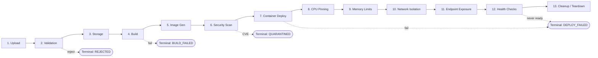
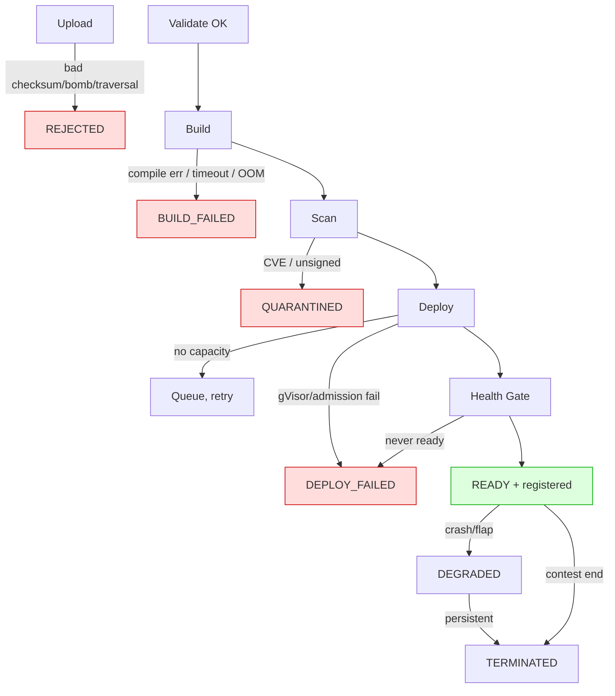

# Track 1 — Submission & Sandboxing Engine
## Deliverable 2: End-to-End Workflow

> Drills the 13 pipeline stages from upload to teardown. Each stage lists **Inputs**,
> **Outputs**, **Services involved**, **Failure modes**, and the **state transition** it
> drives. Read alongside Deliverable 1 (component catalog) and Deliverable 3 (security).

---

## Workflow Overview

Stages 7–11 happen as **one atomic Pod creation** in Kubernetes (a single hardened Pod spec encodes CPU pinning, memory limits, network isolation, and port exposure). They are separated here because each is an independent design concern and an independent failure mode, but the Deployment Manager applies them together.

---

## Stage 1 — User Uploads Code

| Aspect | Detail |
|--------|--------|
| **Inputs** | Contestant identity (API token/OIDC); submission metadata (`language`, `submission_type` = `source`\|`binary`\|`dockerfile`, declared entry/port, declared size, sha256); the artifact bytes (tar.gz of source, or ELF binary). |
| **Outputs** | `submission_id` (UUID); a **pre-signed, single-use, time-boxed** upload URL; a DB row in state `CREATED`; object in raw bucket after the PUT. |
| **Services** | Submission API (authN/authZ, issues id), Upload Service (issues URL), Object Store (receives bytes), Metadata DB (row), Event Bus (`submission.created`). |
| **Mechanism** | Two-phase: (a) `POST /v1/submissions` returns the URL; (b) contestant `PUT`s **directly to object storage** (bytes never transit app pods); (c) `POST /finalize` signals completion. |
| **State** | `[*] → CREATED → UPLOADED` |
| **Failure modes** | • Auth failure → 401, no id. • Declared size over cap → 413 at the edge. • Upload URL expires before PUT → abandoned, GC'd, contestant must restart. • PUT interrupted → finalize fails checksum, retryable. • Duplicate finalize → idempotent (dedupe on `submission_id`). |

**Why direct-to-storage:** routing multi-MB/GB artifacts through application pods is a memory-exhaustion DoS vector and a scaling bottleneck. Pre-signed URLs keep the control plane handling only small JSON.

---

## Stage 2 — Validation

| Aspect | Detail |
|--------|--------|
| **Inputs** | The stored raw object; declared metadata (size, sha256, type). |
| **Outputs** | A `validation_result` (pass/fail + reasons); on pass, transition to `VALIDATING → BUILDING`; on fail, `REJECTED` with reason. |
| **Services** | Upload Service / a Validation worker, Object Store (HEAD/partial GET), Metadata DB, Audit pipeline. |
| **Checks** | 1. **Integrity:** recomputed sha256 == declared. 2. **Size:** within cap. 3. **Type sniffing:** magic-byte check (real gzip/ELF, not a renamed payload). 4. **Archive-bomb guard:** bounded decompression — cap output size and compression ratio; refuse deep/nested archives. 5. **Structure:** source tarball contains a recognizable build manifest (`CMakeLists.txt`/`Cargo.toml`/`go.mod`/`Makefile`/`Dockerfile`) or is declared binary. 6. **Path-traversal guard:** reject archives with `..` or absolute paths (zip-slip). 7. **Symlink guard:** reject symlinks escaping the extraction root. |
| **State** | `UPLOADED → VALIDATING → (BUILDING \| REJECTED)` |
| **Failure modes** | • Checksum mismatch → `REJECTED` (corrupt/tampered). • Zip bomb → `REJECTED`, logged as security event. • No build manifest → `REJECTED` with guidance. • Path traversal/symlink → `REJECTED` + audit alert (likely malicious). |

**Why before build:** validation is cheap; building untrusted code is expensive and dangerous. Catch garbage and obvious attacks before spending an isolated builder.

---

## Stage 3 — Storage

| Aspect | Detail |
|--------|--------|
| **Inputs** | Validated raw artifact + canonical metadata. |
| **Outputs** | Durable, encrypted, versioned object at a deterministic key (`raw/{submission_id}/artifact.tar.gz`); immutable metadata record. |
| **Services** | Object Store (SSE-KMS, versioning, object-lock on the raw copy), Metadata DB. |
| **Mechanism** | The raw upload is already in object storage from Stage 1; Stage 3 **finalizes** it: applies retention/lifecycle tags, records the canonical digest, and grants the upcoming Build Job a **read-only, single-key** IAM scope. |
| **State** | (no transition; this is the durability checkpoint inside `VALIDATING`) |
| **Failure modes** | • Storage write/PUT failure → retprovision/retry. • KMS unavailable → fail closed (no unencrypted storage). • Lifecycle misconfig → caught by IaC policy tests. |

**Why a distinct stage:** separating "validated" from "durably stored + scoped" makes the build step's input immutable and least-privileged. The builder can read exactly one object and nothing else.

---

## Stage 4 — Build Process

| Aspect | Detail |
|--------|--------|
| **Inputs** | `build.requested` event (`submission_id`, language, type); read-only artifact handle; pinned base-image reference. |
| **Outputs** | Compiled artifact inside an image context; build log (streamed to object storage + Loki); `build.succeeded`\|`build.failed`. |
| **Services** | Event Bus (delivers request), Build Service (spawns a **K8s Job per submission**), rootless builder (Kaniko/BuildKit), Object Store (input + log), Metadata DB. |
| **Mechanism** | The Build Job: (1) fetches the artifact; (2) **language detection** picks a hardened, pinned base + build recipe (C++ → CMake/Clang; Rust → cargo; Go → go build; binary → skip compile, wrap; dockerfile → lint + restricted build); (3) compiles **rootless**, **time-boxed**, **memory/CPU-capped**, **egress-restricted** (only base-image mirror); (4) emits the result. |
| **State** | `BUILDING → (SCANNING \| BUILD_FAILED)` |
| **Failure modes** | • Compile error → `BUILD_FAILED`, full log to contestant (terminal, **not** retried). • Build timeout (wall-clock cap) → `BUILD_FAILED` "exceeded build time." • Builder OOM → `BUILD_FAILED`. • Disallowed network access attempt → blocked by NetworkPolicy, logged. • Infra failure (node lost) → retried with backoff (distinct from contestant error). |

**Why a Job per submission:** ephemeral, naturally isolated, auto-cleaned, independently resource-bounded. A crashing/malicious build script harms only its own Job. **Critical:** the builder must never mount the host Docker socket or run privileged — that is a direct host breakout. Rootless daemonless builders exist precisely for untrusted build inputs.

---

## Stage 5 — Docker Image Generation

| Aspect | Detail |
|--------|--------|
| **Inputs** | Build output (binary + runtime deps); a **platform-controlled** Dockerfile/recipe template (contestants don't get to choose an arbitrary base). |
| **Outputs** | An OCI image, content-addressed (`...@sha256:<digest>`), pushed to the registry; a **cosign** signature. |
| **Services** | Build Service / rootless builder, Container Registry, Audit pipeline. |
| **Mechanism** | The recipe assembles a **minimal** runtime image: distroless/Alpine-pinned base + the submission binary + a tiny platform-injected health shim. No shells, package managers, or build tools ship in the runtime image (smaller attack surface). Image is tagged by digest and signed. |
| **State** | (within `BUILDING`/entering `SCANNING`) |
| **Failure modes** | • Push failure (registry down) → retry. • Image exceeds size cap → `BUILD_FAILED`. • Missing/duplicate signing key → fail closed (unsigned images can't deploy). |

**Why platform-controlled images:** if contestants supplied base images, we'd inherit their CVEs and supply-chain risk. A curated, pinned, minimal base shrinks attack surface and keeps benchmarking fair (identical runtime baseline).

---

## Stage 6 — Security Scanning

| Aspect | Detail |
|--------|--------|
| **Inputs** | The pushed image digest. |
| **Outputs** | A scan report (CVEs by severity, secrets, misconfig); a signature-verification result; gate decision `pass`\|`quarantine`. |
| **Services** | Registry scanner (Trivy/Clair), cosign verifier, Admission policy (OPA/Kyverno), Metadata DB, Audit. |
| **Mechanism** | On push, the registry scans layers. Policy gate: **block** on critical/high CVEs in the platform-added layers, on embedded secrets, and on any unsigned image. (Vulnerabilities in *contestant code logic* are not our gate — we gate the **image/supply-chain**, the runtime sandbox handles malicious behavior.) |
| **State** | `SCANNING → (DEPLOYING \| QUARANTINED)` |
| **Failure modes** | • Critical CVE in base → `QUARANTINED`; ops alerted to bump base image. • Unsigned/altered image → `QUARANTINED` + security alert (possible tampering). • Scanner timeout/unavailable → fail closed (don't deploy unscanned). |

**Why scan even though we sandbox:** defense in depth and supply-chain hygiene. Sandboxing contains *runtime* behavior; scanning catches *known* vulnerable/altered components before they ever run.

---

## Stage 7 — Container Deployment

| Aspect | Detail |
|--------|--------|
| **Inputs** | `image.built`/scan-passed event (`submission_id`, signed `image_digest`); resource profile (CPU set, mem cap); the hardened Pod template. |
| **Outputs** | A running **Sandbox Pod** under `runtimeClassName: gvisor` on a tainted untrusted node, plus a `ClusterIP` Service; desired state persisted. |
| **Services** | Deployment Manager (renders + applies spec), Kubernetes API/scheduler, Sandbox Runtime (gVisor), Admission policy (enforces hardening), Metadata DB. |
| **Mechanism** | The Deployment Manager renders a Pod spec that pins all security + resource settings (Stages 8–11), sets `imagePullPolicy` to the exact digest, schedules onto the untrusted pool via nodeSelector/tolerations, and creates a Service for stable discovery. Admission control rejects the Pod if any hardening field is missing — **the policy, not the controller, is the final gate.** |
| **State** | `DEPLOYING → HEALTH_CHECK` (or `DEPLOY_FAILED`) |
| **Failure modes** | • No capacity on untrusted pool → autoscaler adds a node; if capped, submission **queues** (not fails). • Image pull failure → retry then `DEPLOY_FAILED`. • Admission rejection (spec not hardened) → `DEPLOY_FAILED` + ops alert (a bug in our template, never a silent unsafe deploy). • gVisor start failure → `DEPLOY_FAILED`, **no fallback to runc**. |

---

## Stage 8 — CPU Pinning

| Aspect | Detail |
|--------|--------|
| **Inputs** | Submission resource profile (e.g. 2 dedicated cores). |
| **Outputs** | A Pod whose container is bound to a fixed, exclusive CPU set via cgroups v2 `cpuset`. |
| **Services** | Kubernetes **CPU Manager** (`static` policy) + Deployment Manager (requests `Guaranteed` QoS with integer CPU). |
| **Mechanism** | Setting `requests == limits` as **integer** CPUs and enabling the kubelet `static` CPU Manager policy gives the container **exclusive** cores (no sharing, no scheduler migration). This is what makes latency numbers fair and comparable across submissions. |
| **State** | (within `DEPLOYING`) |
| **Failure modes** | • Fractional CPU request → not pinned (validation rejects non-integer for submissions). • Node lacks free exclusive cores → scheduler waits/triggers scale-up. • Topology contention (NUMA) → use Topology Manager to keep CPU+memory on one NUMA node for predictable latency. |

**Why it's also security:** pinning bounds how much CPU a malicious submission can consume — it cannot starve neighbors or the node.

---

## Stage 9 — Memory Limits

| Aspect | Detail |
|--------|--------|
| **Inputs** | Memory cap from the profile (e.g. 512 MiB). |
| **Outputs** | A cgroups v2 `memory.max` (+ `memory.swap.max=0`) enforced on the container. |
| **Services** | Kubernetes (translates `resources.limits.memory` to cgroup v2), Linux kernel OOM killer, Health Monitor (observes OOM events). |
| **Mechanism** | `requests==limits` memory → `Guaranteed` QoS. The kernel enforces `memory.max`; exceeding it triggers an in-cgroup OOM kill **scoped to the sandbox** (cannot OOM the node or neighbors). Swap disabled so memory pressure can't be hidden via paging (keeps latency honest). |
| **State** | (within `DEPLOYING`) |
| **Failure modes** | • Submission exceeds cap → OOM-killed inside its sandbox → liveness fails → `health.dead` event (Track 3 annotates "failed at memory pressure"). • Memory bomb (rapid alloc) → contained by `memory.max`, neighbors unaffected. |

**Why it's also fairness:** equal memory caps mean no submission "wins" by hogging RAM; it must perform within the same envelope as everyone else.

---

## Stage 10 — Network Isolation

| Aspect | Detail |
|--------|--------|
| **Inputs** | The submission's single declared listen port; the platform network policy template. |
| **Outputs** | A network namespace per sandbox + a **default-deny** `NetworkPolicy` allowing only: (ingress) Bot-Fleet → port P, and platform Health-Monitor → health port; (egress) **none** (or DNS-only if strictly required). |
| **Services** | CNI plugin (Calico/Cilium) enforcing `NetworkPolicy`, Kubernetes, Deployment Manager. |
| **Mechanism** | Each Pod has its own network namespace (isolated interfaces, routing, firewall). A `NetworkPolicy` denies all traffic by default, then whitelists exactly the order-ingress and health paths. **No egress** means a malicious submission cannot phone home, attack the internet, reach the control plane/DB, or scan other sandboxes. |
| **State** | (within `DEPLOYING`) |
| **Failure modes** | • Policy misapplied (fail-open) → blocked by admission test that asserts a deny-all policy exists; CI policy tests catch regressions. • Submission tries lateral movement → dropped + logged as a security event. • Legitimate DNS need → a tightly-scoped DNS egress rule only if the contest protocol requires it. |

---

## Stage 11 — Endpoint Exposure

| Aspect | Detail |
|--------|--------|
| **Inputs** | The running, isolated Pod + its Service. |
| **Outputs** | A stable in-cluster endpoint (`submission-{id}.untrusted.svc:PORT`), **not yet** registered for traffic until health passes. |
| **Services** | Kubernetes Service/DNS, Deployment Manager, (later) Service Registry. |
| **Mechanism** | A `ClusterIP` Service gives a stable virtual IP/DNS name decoupled from Pod IP churn. Exposure is **internal-only** — the Bot Fleet and Telemetry run in-cluster; submissions are never internet-exposed. Registration into the discoverable registry is deferred to **after** Stage 12. |
| **State** | (bridges `DEPLOYING → HEALTH_CHECK`) |
| **Failure modes** | • Service selector mismatch → endpoint resolves to nothing → caught by health gate (stays unregistered). • Port mismatch (submission binds a different port than declared) → health handshake fails → `DEPLOY_FAILED`. |

---

## Stage 12 — Health Checks

| Aspect | Detail |
|--------|--------|
| **Inputs** | The exposed endpoint + declared protocol (REST/WS) + health route. |
| **Outputs** | Readiness verdict; on success a **Service Registry entry** (`READY`) + `deployment.ready` event carrying the endpoint; continuous liveness thereafter. |
| **Services** | Health Monitor (active protocol handshake), Kubernetes probes (`readinessProbe`/`livenessProbe`), Service Registry (Redis), Event Bus, TimescaleDB (health samples). |
| **Mechanism** | Two layers: (1) **K8s readiness probe** confirms the process is up; (2) the **Health Monitor performs a protocol-level handshake** — actually opens the WebSocket / calls the REST health route — proving the endpoint can accept orders. Only then does the Deployment Manager register it and emit `deployment.ready`. Liveness probes continue for the submission's lifetime; failures drive `DEGRADED`/`health.dead`. |
| **State** | `HEALTH_CHECK → READY` (register) → possibly `DEGRADED` ↔ `READY` |
| **Failure modes** | • Never becomes ready within the grace window → `DEPLOY_FAILED`, stays out of registry (Track 2 never hits a dead endpoint). • Ready then crashes → liveness fails → restart policy + `health.dead` so Track 3 marks the run. • Flapping → `DEGRADED`; persistent → eviction + `deployment.terminated`. |

**Why a protocol handshake, not just "process up":** a binary can start and idle without binding its port. Registering such an endpoint would feed Track 2 garbage. The handshake is the contract that "READY means actually serving."

---

## Stage 13 — Cleanup & Teardown

| Aspect | Detail |
|--------|--------|
| **Inputs** | A teardown trigger: contest window end, explicit terminate, eviction after persistent `DEGRADED`, or TTL expiry. |
| **Outputs** | Sandbox Pod + Service deleted; registry entry removed; final logs/metrics flushed to durable storage; `deployment.terminated` event; submission → `TERMINATED`. |
| **Services** | Deployment Manager (drives deletion), Kubernetes (GC), Service Registry (deregister), Object Store (archive logs), Audit pipeline, Build-Job GC. |
| **Mechanism** | Ordered teardown: (1) **deregister** from the Service Registry so no new traffic arrives; (2) drain/grace period; (3) delete Pod + Service; (4) flush stdout/stderr + final resource samples to durable storage; (5) emit `deployment.terminated`; (6) lifecycle policy later expires raw artifacts/images. Ephemeral Build Jobs are TTL-garbage-collected separately. |
| **State** | `READY`/`DEGRADED` → `TERMINATED → [*]` |
| **Failure modes** | • Deregister-after-delete ordering bug → race where Track 2 hits a dead endpoint; prevented by **deregister-first** ordering. • Orphaned Pod (controller crash mid-teardown) → reconciliation loop + a sweeper that deletes Pods whose submission is `TERMINATED`. • Storage flush failure → retried; logs buffered so none are lost. • Leaked resources → namespace `ResourceQuota` + periodic GC reclaim. |

**Why teardown is first-class, not an afterthought:** in a contest with many short-lived submissions, leaked sandboxes/Jobs would exhaust the cluster and skew fairness. Deterministic, ordered, idempotent teardown keeps capacity available and the registry truthful.

---

## End-to-End Timing Budget (illustrative, MVP)

| Stage | Typical | Hard cap |
|-------|---------|----------|
| Upload + validate | seconds | size/time-boxed |
| Build (C++/Rust) | 1–5 min | 10 min → fail |
| Image push + scan | 20–60 s | 3 min → fail |
| Deploy + schedule | 5–30 s | 2 min → fail |
| Health gate | 5–30 s | grace window → fail |
| **Upload → READY** | **~2–7 min** | bounded at every step |

Every stage is **bounded** so a stuck submission can never occupy the pipeline indefinitely — essential for fairness and capacity under load.

---

## Failure-Mode Summary (one screen)

Every red terminal state carries a **contestant-readable reason** and an **audit record**; every transition emits an event for Track 3/4.

---

*Next: Deliverable 3 (Security Architecture) explains the kernel-level mechanisms — namespaces, cgroups v2, seccomp, AppArmor, capabilities, rootless, gVisor — and the threat models behind them.*
