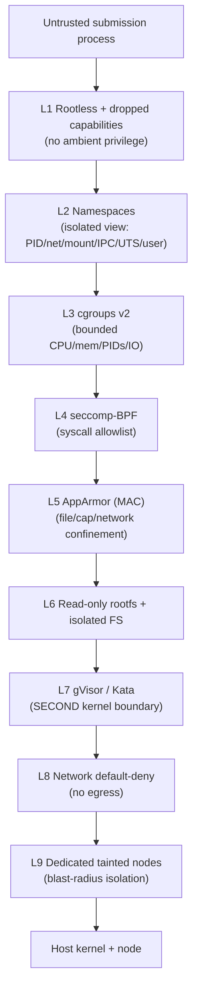
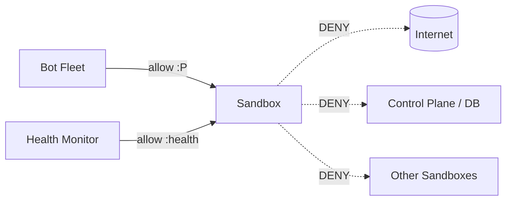
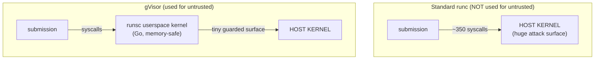
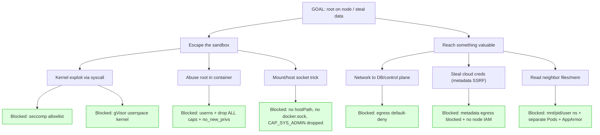

# Track 1 — Submission & Sandboxing Engine
## Deliverable 3: Security Architecture

> **Threat assumption (stated up front):** A contestant submission is **actively hostile**.
> It may be a crafted binary whose goal is to break out of the container, read other
> contestants' code or data, attack the control plane, exhaust the node, phone home, or
> tamper with its own benchmark results. Every mechanism below is justified against *that*
> adversary, not against accidental bugs.

---

## 1. Security Model Overview

### 1.1 The core problem
A normal container is **not** a security boundary by itself. `runc` containers share the **host Linux kernel**: a single kernel privilege-escalation bug (and there is a steady stream of them — `Dirty COW`, `Dirty Pipe`, various `io_uring`, eBPF, and overlayfs CVEs) turns "I run code in a container" into "I am root on the node." Because we *invite arbitrary native binaries to run*, we must treat the host kernel as something the attacker will try to exploit.

### 1.2 Defense-in-depth stack
We layer **independent** mechanisms so that defeating one does not yield a breach:



**Why layered:** seccomp shrinks the syscall attack surface; gVisor means the syscalls that *are* allowed hit a **userspace** kernel, not the host kernel; AppArmor adds mandatory access control; namespaces remove visibility of anything to attack; cgroups remove the ability to exhaust; network policy removes reachability; tainted nodes bound the blast radius. An attacker must defeat **all** layers, and several (gVisor, separate nodes) are hard walls.

### 1.3 The trust gradient
| Plane | Runtime | Kernel | Node pool |
|-------|---------|--------|-----------|
| Control plane (trusted) | standard | host | control pool |
| Build plane (semi-trusted: runs build scripts) | rootless builder, no host socket | host (hardened) | build pool |
| **Data plane (untrusted)** | **gVisor/Kata** | **isolated** | **tainted untrusted pool** |

---

## 2. Mechanism-by-Mechanism

For each: **what it is**, **how it works**, **what it protects against**, and **how we configure it**.

### 2.1 Linux Namespaces — *isolated views of the system*

**What:** Namespaces virtualize global kernel resources so a process sees its own private instance. The relevant ones:

| Namespace | Isolates | Effect on a malicious submission |
|-----------|----------|----------------------------------|
| **PID** | Process ID space | Sees only its own processes; cannot `kill`/`ptrace`/inspect host or neighbor PIDs. Its "PID 1" is just its entrypoint. |
| **Network (net)** | Interfaces, routes, firewall, sockets | Gets its own loopback + one veth; cannot see host interfaces or sniff/ARP-spoof other sandboxes. |
| **Mount (mnt)** | Filesystem mount table | Sees only its own rootfs; cannot see host mounts, `/var/lib/...`, or other containers' layers. |
| **IPC** | SysV IPC, POSIX message queues, shared memory | Cannot attach to host/neighbor shared memory segments. |
| **UTS** | Hostname/domainname | Cannot change host identity. |
| **User (userns)** | UID/GID mapping | **Root inside ≠ root outside.** UID 0 in the sandbox maps to an unprivileged, high host UID with no real authority. |
| **cgroup** | cgroup root view | Cannot see/escape the host cgroup hierarchy. |

**How it works:** `clone()`/`unshare()` with `CLONE_NEW*` flags create new namespaces; the container runtime sets these up before exec'ing the workload. The kernel then scopes every relevant lookup to the process's namespace.

**Protects against:** host/neighbor reconnaissance, process killing, network sniffing, filesystem snooping, IPC injection, and (via **user namespaces**) privilege escalation — the single most important one here, because it neutralizes "I am root in the container."

**Our config:** every sandbox gets fresh PID/net/mnt/IPC/UTS/**user**/cgroup namespaces. User namespaces are **mandatory** (rootless). `hostPID`, `hostNetwork`, `hostIPC` are **forbidden** by admission policy.

> **Limit of namespaces alone:** they isolate *views*, not the *kernel attack surface*. A namespaced process still calls the host kernel directly — hence layers 4–7.

### 2.2 cgroups v2 — *bounded resource consumption*

**What:** Control Groups v2 is the kernel's unified hierarchy for limiting and accounting CPU, memory, PIDs, and I/O per group of processes.

**How it works (the controllers we use):**
- `cpu.max` / `cpuset.cpus` — cap CPU bandwidth and **pin** to exclusive cores.
- `memory.max` — hard memory ceiling; breach → in-cgroup OOM kill. `memory.swap.max=0` — no hiding under swap.
- `pids.max` — **cap the number of processes/threads** in the cgroup.
- `io.max` — throttle disk IOPS/bandwidth.

**Protects against:**
- **Fork bombs** (`:(){ :|:& };:`): `pids.max` caps total tasks (e.g. 256). The bomb hits the ceiling and `fork()` returns `EAGAIN` — the sandbox thrashes its *own* limit and dies; the node is untouched. **This is the primary fork-bomb defense.**
- **Memory bombs:** `memory.max` triggers a scoped OOM kill; neighbors and node unaffected.
- **CPU starvation/cryptomining:** `cpuset` pinning means a submission physically cannot use cores it wasn't assigned.
- **Disk-thrash DoS:** `io.max` throttles.

**Our config:** Kubernetes `Guaranteed` QoS (`requests==limits`, integer CPU) → exclusive `cpuset`; explicit `memory.max`, swap off; a `pids.max` via a Pod-level limit / runtime default; `io.max` on the untrusted pool. cgroups v2 (unified) is required on all untrusted nodes.

### 2.3 seccomp — *system-call allowlist*

**What:** `seccomp-bpf` filters which syscalls a process may make. The kernel evaluates a BPF program on every syscall and can allow, deny (`EPERM`), or kill.

**How it works:** We attach a **deny-by-default** profile that allows only the ~40–60 syscalls a network service legitimately needs (`read`, `write`, `epoll_*`, `futex`, `socket`, `accept4`, `sendto`, `recvfrom`, `mmap`, `clock_gettime`, etc.) and **blocks** the dangerous ones: `ptrace`, `kexec_load`, `init_module`/`finit_module` (no kernel modules), `bpf`, `mount`/`umount`, `pivot_root`, `setns`, `unshare`, `keyctl`, `perf_event_open`, `process_vm_readv/writev`, raw `clone` with namespace flags, etc.

**Protects against:** the vast majority of kernel exploits, which depend on reaching an obscure or buggy syscall. If the exploit's entry syscall isn't on the allowlist, the exploit can't even start. It dramatically shrinks the **kernel attack surface**.

**Our config:** a custom hardened profile (stricter than Docker's default) referenced via the Pod `securityContext.seccompProfile` (type `Localhost`, our profile) — and additionally, under gVisor, these syscalls hit gVisor's reimplementation, not the host. Two independent reasons the syscall is safe.

### 2.4 AppArmor — *mandatory access control (MAC)*

**What:** A Linux Security Module that confines a program to a profile of allowed file paths, capabilities, and network operations — enforced by the kernel regardless of file ownership/DAC.

**How it works:** The profile says, e.g., "this binary may read its own rootfs, may write only `/tmp` (tmpfs), may not read `/proc/*/mem`, may not load kernel modules, may not use raw network." Even if the process is "root" in its userns, AppArmor still denies anything outside the profile.

**Protects against:** DAC bypasses, reads of sensitive procfs/sysfs paths, unexpected file writes, and capability use that slipped through — a backstop independent of UID and of seccomp.

**Our config:** a restrictive AppArmor profile loaded on untrusted nodes and referenced via the Pod annotation; `unconfined` is **forbidden** by admission policy. (SELinux is an equivalent alternative on RHEL-family nodes; pick one consistently.)

### 2.5 Capabilities dropping — *remove root's superpowers*

**What:** Linux splits root's power into ~40 **capabilities** (`CAP_NET_ADMIN`, `CAP_SYS_ADMIN`, `CAP_SYS_PTRACE`, `CAP_DAC_OVERRIDE`, ...). A process can be "root" yet hold none.

**How it works:** We set `capabilities.drop: ["ALL"]` and add back **nothing** (a network listener on a high port needs zero capabilities). `allowPrivilegeEscalation: false` + `no_new_privs` ensures a setuid binary in the image can't regain privileges.

**Protects against:** `CAP_SYS_ADMIN` (the "new root", enables mount/namespace tricks central to many escapes), `CAP_SYS_PTRACE` (debugging neighbors), `CAP_NET_RAW` (packet spoofing/sniffing), `CAP_DAC_OVERRIDE` (ignoring file permissions), `CAP_SYS_MODULE` (loading kernel modules). Dropping ALL removes the toolbox most escapes rely on.

**Our config:** `drop: ALL`, no adds, `allowPrivilegeEscalation: false`, `privileged: false` — enforced by admission policy.

### 2.6 Rootless containers — *no real root anywhere*

**What:** The container (and ideally the runtime/builder) runs as a **non-root** host user; combined with user namespaces, in-container UID 0 maps to an unprivileged host UID.

**How it works:** `runAsNonRoot: true`, `runAsUser: <high uid>`, user-namespace remapping so even `uid 0` workloads are powerless on the host. The **builder** is also rootless (Kaniko/BuildKit-rootless) so build scripts never get host root.

**Protects against:** the classic escape chain "root in container → exploit → root on host." If "root in container" is already an unprivileged host user, the most valuable rung of the ladder is gone. Also protects the **build** stage, where contestant-controlled build scripts execute.

**Our config:** rootless data plane **and** build plane; **never** mount the host Docker/containerd socket (that is an instant breakout); no privileged sidecars.

### 2.7 Network isolation — *unreachable by default*

**What:** Per-sandbox network namespace + a Kubernetes `NetworkPolicy` enforced by a CNI (Calico/Cilium) that **denies all** traffic, then allows only the two required paths.

**How it works:**
- **Ingress allow:** Bot-Fleet pods → submission port `P`; Health-Monitor → health port. Everything else dropped.
- **Egress allow:** **nothing** (or, only if the contest protocol strictly needs it, scoped DNS). No internet, no control plane, no DB, no other sandbox.



**Protects against:** data exfiltration / "phone home", C2 channels, lateral movement, attacks on the control plane or DB, and cross-submission cheating (e.g. one submission DoSing a rival).

**Our config:** a default-deny `NetworkPolicy` per untrusted namespace + explicit allow rules; egress to the metadata API / cloud metadata endpoint (`169.254.169.254`) **explicitly blocked** (cloud-metadata SSRF is a common credential-theft path).

### 2.8 Filesystem isolation & read-only root — *nothing to tamper with*

**What:** The container root filesystem is mounted **read-only**; only a small, size-capped `tmpfs` (`/tmp`, `noexec,nosuid,nodev`) is writable.

**How it works:** `readOnlyRootFilesystem: true`; writable scratch is an `emptyDir` with `medium: Memory` and a size limit, mounted `noexec` so the submission can't drop and execute a second-stage payload. Mount namespace + minimal (distroless) image means there's almost nothing on disk to abuse (no shell, no package manager, no compilers in the runtime image).

**Protects against:** persistence, tampering with the binary/config, writing exploit payloads to disk and executing them, filling the node disk, and reading host/neighbor files (mount namespace already hides them).

**Our config:** RO rootfs, `tmpfs` scratch (`noexec,nosuid,nodev`, capped), distroless runtime image, no `hostPath` mounts (forbidden by admission policy).

### 2.9 gVisor / Kata — *a second kernel boundary (the keystone)*

**What:** 
- **gVisor (`runsc`)** is a **userspace kernel** written in Go. It intercepts the container's syscalls and services them itself, exposing a tiny, memory-safe surface to the host kernel.
- **Kata Containers** runs the container inside a lightweight **microVM** (hardware virtualization), so the boundary is the VM hypervisor.

**How it works (gVisor):** the submission's syscalls are trapped (via ptrace or KVM) and handled by gVisor's reimplementation of Linux. The host kernel sees only gVisor's small, guarded set of operations — not the full, exploitable Linux syscall surface.



**Protects against:** host-kernel exploits. Even if a submission has a working `runc`-era kernel exploit, it now lands in gVisor's userspace kernel, not the host's — the exploit target isn't there. This is what makes "we run arbitrary hostile binaries" defensible.

**Our config:** `runtimeClassName: gvisor` on all untrusted sandboxes (primary). Kata available as a higher-isolation `RuntimeClass` for stricter scenarios or if a workload is gVisor-incompatible. **Fail closed:** if the sandboxed runtime can't start, the submission fails — we never silently fall back to `runc`.

### 2.10 Resource-abuse prevention (consolidated)

| Attack | Mechanism | Result |
|--------|-----------|--------|
| Fork bomb | `pids.max` | `fork()` → `EAGAIN`; self-limited |
| Memory bomb | `memory.max` + swap off | scoped OOM kill |
| CPU hog / miner | `cpuset` pinning + `cpu.max` | capped to assigned cores |
| Disk thrash | `io.max` + RO rootfs + capped tmpfs | throttled, no host disk fill |
| Network flood / exfil | default-deny `NetworkPolicy` | no egress |
| Neighbor attack | namespaces + separate nodes | not reachable/visible |
| Host kernel exploit | gVisor + seccomp + dropped caps | surface removed |
| Privilege escalation | userns + `no_new_privs` + drop ALL | root is powerless |

---

## 3. Threat Models

We use a lightweight STRIDE-style enumeration focused on the untrusted submission and the pipeline that handles it.

### 3.1 Threat catalog

| ID | Threat | Vector | Primary controls | Residual risk |
|----|--------|--------|------------------|---------------|
| T1 | **Container escape to host** | Kernel exploit via syscall | gVisor (L7), seccomp (L4), drop caps (L1), userns (L2), tainted nodes (L9) | Low — needs a gVisor escape *and* node compromise |
| T2 | **Cross-submission attack / data theft** | Lateral network or shared kernel resource | net default-deny (L8), namespaces (L2), separate Pods, no shared volumes | Low |
| T3 | **Control-plane / DB compromise** | Submission reaches internal services | no egress (L8), no DB network path, RBAC least-privilege | Low |
| T4 | **Credential theft via cloud metadata** | SSRF to `169.254.169.254` | egress block to metadata IP, IMDSv2, no node IAM on untrusted pool | Low |
| T5 | **Resource exhaustion / noisy neighbor** | Fork/memory/CPU/IO bomb | cgroups v2 limits (L3), pinning | Very low (contained) |
| T6 | **Malicious build script** | Arbitrary code at build time | rootless builder, no host socket, build-time NetworkPolicy, time/mem caps, build pool | Low |
| T7 | **Supply-chain (poisoned base/image)** | Vulnerable/altered layers | pinned bases, Trivy scan gate, cosign verify, admission policy | Low |
| T8 | **Benchmark tampering / result forgery** | Submission spoofs health or metrics | platform-side health handshake, Track-3 measures externally, signed events | Low |
| T9 | **Data-plane DoS of the platform** | Huge upload, build flood, deploy flood | size caps, pre-signed direct upload, build queue + quota, autoscaler caps | Low |
| T10 | **Log/audit tampering or injection** | Malicious stdout, terminal escapes | sanitize submission output, append-only WORM audit, separate audit stream | Low |
| T11 | **Zip/decompression bomb** | Crafted archive | bounded decompression (ratio+size caps), type sniffing | Low |
| T12 | **Path traversal / zip-slip** | Archive with `..`/symlinks | extraction guard rejects traversal/symlinks | Low |
| T13 | **Persistence across runs** | Write payload, survive restart | RO rootfs, ephemeral Pods, no persistent volume on data plane | None (nothing persists) |
| T14 | **Privilege escalation in-container** | setuid/cap regain | `no_new_privs`, `allowPrivilegeEscalation:false`, drop ALL, userns | Low |

### 3.2 Attack-tree: "escape and pivot"



Every leaf path terminates in a **blocked** control. The design intent: no single-control failure produces a breach; the attacker must chain multiple independent bypasses (e.g. a gVisor 0-day **and** a node-IAM misconfig **and** an egress-policy gap).

### 3.3 Assumed-breach posture
We also plan for "what if one sandbox is somehow escaped":
- **Tainted dedicated node pool** for untrusted workloads → blast radius is that node pool, never the control plane.
- **No node IAM role** (or an empty one) on untrusted nodes → a compromised node yields no cloud credentials.
- **Runtime threat detection** (Falco) watches for escape-indicative syscalls/behaviors and alerts + can auto-quarantine the node.
- **Short-lived everything** → sandboxes and nodes are cattle; a suspect node is cordoned, drained, and destroyed.

---

## 4. Security of the Pipeline Itself (not just the sandbox)

| Stage | Risk | Control |
|-------|------|---------|
| Upload | Oversized/poisoned artifact, SSRF via URL | size caps, direct-to-storage, no server-side fetch of contestant URLs |
| Validation | Decompression bomb, zip-slip | bounded decompression, traversal/symlink rejection |
| Build | Malicious build script | rootless, no socket, egress-restricted, time/mem-boxed, isolated Job/pool |
| Image | Poisoned base, secret leak | pinned base, Trivy secret/CVE scan, distroless runtime |
| Registry | Unsigned/tampered image | cosign sign + admission verify |
| Deploy | Unsafe Pod spec slips through | OPA/Kyverno admission **denies** any Pod missing hardening fields |
| Runtime | All sandbox threats | the L1–L9 stack above |
| Teardown | Orphan leaks, log loss | deregister-first ordering, reconciliation sweeper, buffered log shipping |

**Admission control is the linchpin:** a cluster-wide policy (OPA Gatekeeper / Kyverno) **rejects** any Pod scheduled to the untrusted namespace that is not: rootless, non-privileged, `drop: ALL`, `readOnlyRootFilesystem`, `runtimeClassName: gvisor`, has a default-deny NetworkPolicy, `Guaranteed` QoS, seccomp+AppArmor set, no `hostPath`/`hostNetwork`/`hostPID`/`hostIPC`. This guarantees that even a buggy Deployment Manager cannot deploy an unsafe sandbox — **the policy, not the code, is the final authority.**

---

## 5. Secrets, Identity & Least Privilege

- **mTLS between all internal services** (SPIFFE/SPIRE or cert-manager issued identities).
- **Per-service Kubernetes ServiceAccounts** with minimal RBAC: the Deployment Manager can create Pods only in the untrusted namespace; the Build Service can create Jobs only in the build namespace; neither can read Secrets they don't own.
- **Per-service DB roles**: the API can write `submissions`; the Build Service can write `builds`; nobody but migrations can `ALTER`.
- **Scoped object-storage IAM**: a Build Job can read exactly its one artifact key.
- **No long-lived cloud creds on untrusted nodes.**
- **Secrets via a manager** (Vault / cloud secrets manager), never baked into images or env files committed to git.

---

## 6. Detection, Response & Audit

| Capability | Tool | Purpose |
|-----------|------|---------|
| Runtime anomaly detection | **Falco** | Alert on escape-indicative syscalls (e.g. unexpected `ptrace`, `mount`, write to `/etc`), shell spawns in distroless images |
| Admission policy | **OPA Gatekeeper / Kyverno** | Prevent unsafe specs pre-deploy |
| Image scanning | **Trivy/Clair** | CVE + secret gate |
| Image signing | **cosign** | Provenance/integrity |
| Network visibility | **Cilium/Hubble** | Observe/deny flows, detect lateral attempts |
| Immutable audit | append-only object store (WORM) | Tamper-evident record of every security-relevant action |
| Metrics/alerts | Prometheus + Alertmanager | OOM kills, policy denials, probe failures, quota exhaustion |

**Incident response (sandbox suspected compromised):** cordon node → snapshot for forensics → drain & destroy node → quarantine the submission → audit review. Because untrusted nodes are disposable and isolated, response is "delete and rebuild," not "clean up."

---

## 7. Security Checklist (enforced by admission + CI policy tests)

```
Pod (untrusted namespace) MUST:
  [x] runtimeClassName: gvisor (or kata)
  [x] securityContext.runAsNonRoot: true
  [x] runAsUser: high, non-zero
  [x] privileged: false
  [x] allowPrivilegeEscalation: false
  [x] capabilities.drop: ["ALL"]   (add: none)
  [x] readOnlyRootFilesystem: true
  [x] seccompProfile: Localhost (hardened profile)
  [x] AppArmor profile: restricted (not unconfined)
  [x] resources.requests == limits (Guaranteed QoS), integer CPU
  [x] memory limit set; swap disabled on node
  [x] pids limit enforced
  [x] NO hostPath / hostNetwork / hostPID / hostIPC
  [x] nodeSelector + toleration -> untrusted pool only
  [x] default-deny NetworkPolicy present; egress blocked (incl. 169.254.169.254)
  [x] image is signed (cosign) + scanned (Trivy) by digest
Builder (build namespace) MUST:
  [x] rootless; NO docker.sock / containerd.sock mount
  [x] egress restricted to registry + base mirror
  [x] wall-clock + memory + CPU caps
```

Any unchecked box → admission **denies** the workload. The checklist is encoded as policy and tested in CI, so it cannot silently regress.

---

*Next: Deliverable 4 (Infrastructure Design) maps these controls onto concrete Kubernetes objects, namespaces, node pools, and cluster topology.*
