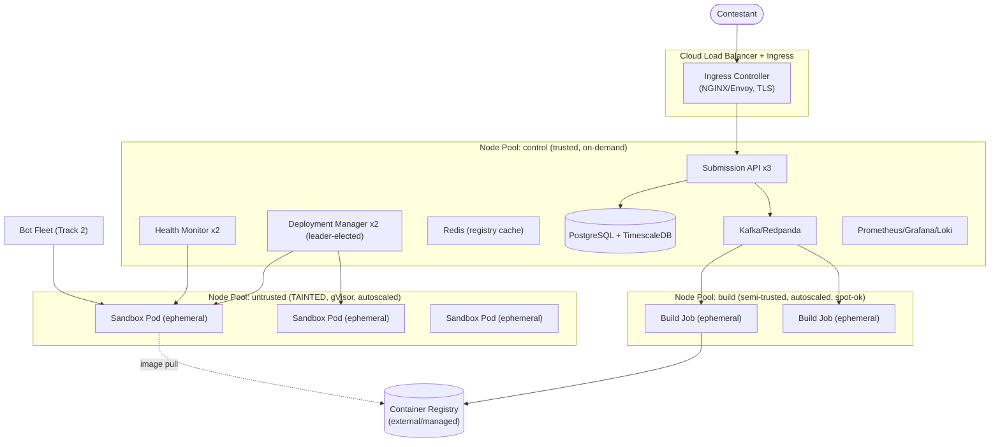
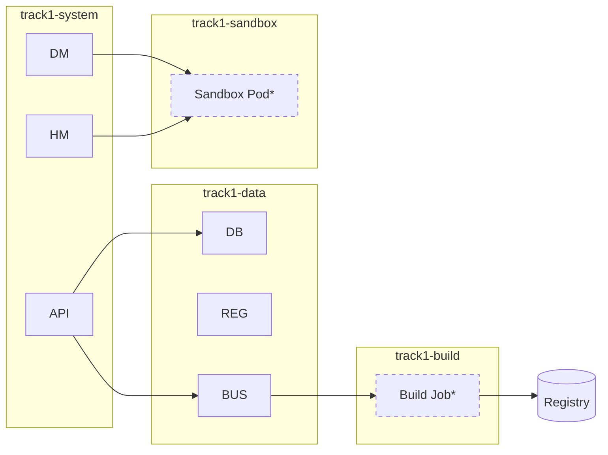

# Track 1 — Submission & Sandboxing Engine
## Deliverable 4: Infrastructure Design (Kubernetes)

> Maps the architecture (D1) and security controls (D3) onto concrete Kubernetes objects:
> namespaces, node pools, Deployments, Jobs, Services, Ingress, NetworkPolicies, and
> Persistent Volumes. Marks clearly which workloads are **permanent** vs **ephemeral**.

---

## 1. Cluster Topology

A single regional Kubernetes cluster (multi-AZ) with **three isolated node pools**. Node-pool separation is a security control (D3 §3.3): untrusted workloads never share a kernel/node with the control plane.



### 1.1 Node pools

| Pool | Trust | Runtime | Taints / Labels | Scaling | Instance type |
|------|-------|---------|-----------------|---------|---------------|
| **control** | trusted | runc | `workload=control` | fixed/HPA, on-demand | general purpose, stable |
| **build** | semi-trusted | runc + rootless builder | `workload=build:NoSchedule` | cluster-autoscaler 0→N | compute, spot acceptable |
| **untrusted** | **untrusted** | **gVisor (runsc)** | `workload=untrusted:NoSchedule`, `sandbox=true` | cluster-autoscaler 0→N | **CPU-optimized, dedicated cores** (for pinning) |

Only Pods that explicitly **tolerate** `workload=untrusted` and select `sandbox=true` land on the untrusted pool. Combined with admission policy, nothing trusted can be scheduled there and nothing untrusted can escape to control nodes.

---

## 2. Namespaces

Namespaces give RBAC scoping, NetworkPolicy scoping, and ResourceQuota scoping.

| Namespace | Purpose | Trust | Notable policies |
|-----------|---------|-------|------------------|
| `track1-system` | API, Upload, Deployment Mgr, Health Mgr | trusted | RBAC to manage `track1-sandbox`; egress to DB/bus |
| `track1-data` | PostgreSQL/TimescaleDB, Redis, Kafka/Redpanda | trusted | only `track1-system` may connect |
| `track1-build` | ephemeral Build Jobs | semi-trusted | egress: registry + base mirror only; quota-capped |
| `track1-sandbox` | **untrusted submission Pods** | **untrusted** | **default-deny NetworkPolicy**, strict admission, quota, LimitRange |
| `track1-observability` | Prometheus, Grafana, Loki, Alertmanager | trusted | scrape access cluster-wide (read-only) |
| `track1-security` | OPA/Kyverno, Falco, Trivy operator | trusted | admission webhooks, runtime detection |


`*` = ephemeral.

---

## 3. Workload Inventory — Permanent vs Ephemeral

### 3.1 Permanent workloads (Deployments / StatefulSets)

| Workload | Kind | Replicas | Namespace | Why permanent |
|----------|------|----------|-----------|---------------|
| Submission API | Deployment | 3 (HPA 3–10) | `track1-system` | Always-on front door |
| Deployment Manager | Deployment | 2 (leader-elected) | `track1-system` | Continuous reconciliation |
| Health Monitor | Deployment | 2 | `track1-system` | Continuous probing |
| Service Registry (Redis) | StatefulSet | 3 (1 primary + 2 replica) | `track1-data` | Always-on discovery |
| Metadata DB (Postgres+Timescale) | StatefulSet | 1 primary + 1 sync replica | `track1-data` | Durable truth |
| Event Bus (Redpanda/Kafka) | StatefulSet | 3 | `track1-data` | Durable eventing |
| Ingress Controller | Deployment/DaemonSet | 2+ | `track1-system` | Edge routing |
| OPA/Kyverno, Falco | Deployment/DaemonSet | per node | `track1-security` | Policy + detection |
| Prometheus/Grafana/Loki | StatefulSet/Deployment | 1–2 | `track1-observability` | Observability |

### 3.2 Ephemeral workloads (Jobs / per-submission Pods)

| Workload | Kind | Lifetime | Namespace | Created by | Cleaned by |
|----------|------|----------|-----------|-----------|-----------|
| **Build Job** | Job (`ttlSecondsAfterFinished`) | minutes (one build) | `track1-build` | Build Service (from event) | TTL controller |
| **Sandbox Pod** | Pod + Service (per submission) | contest window / until teardown | `track1-sandbox` | Deployment Manager | Deployment Manager (deregister-first) |
| Validation Job (optional) | Job | seconds | `track1-build` | Upload Service | TTL |

> **Design choice — why a bare Pod (not a Deployment) per sandbox:** each submission is a singleton with a fixed lifetime; we do **not** want K8s auto-recreating it endlessly or load-balancing replicas (benchmarking must hit *one* instance). The Deployment Manager owns its lifecycle explicitly so teardown and registry state stay consistent. (A `Deployment` with `replicas:1` is an acceptable alternative if controlled restarts are desired; the spec stays identical.)

---

## 4. Key Object Specifications (described, not coded)

### 4.1 Sandbox Pod (the heart of Track 1)

**Shape (fields, not YAML):**
- `metadata.labels`: `submission_id`, `app=sandbox`, `sandbox=true`
- `spec.runtimeClassName: gvisor`
- `spec.nodeSelector: { sandbox: "true" }`, `tolerations: [workload=untrusted]`
- `spec.automountServiceAccountToken: false` (no API creds in the sandbox)
- `securityContext` (pod + container): `runAsNonRoot`, high `runAsUser/fsGroup`, `seccompProfile: Localhost`, AppArmor annotation
- container `securityContext`: `privileged:false`, `allowPrivilegeEscalation:false`, `readOnlyRootFilesystem:true`, `capabilities.drop:[ALL]`
- `resources`: `requests==limits`, **integer** `cpu` (pinning), explicit `memory`; → **Guaranteed** QoS
- `volumes`: one `emptyDir{medium:Memory, sizeLimit}` mounted at `/tmp` (`noexec,nosuid,nodev`); **no** hostPath, **no** PVC
- `ports`: the single declared submission port + a health port
- probes: `readinessProbe` (TCP/HTTP) gating Service endpoints; `livenessProbe` for ongoing health
- `imagePullPolicy`: pinned digest only

**Paired objects:** a `ClusterIP` Service (`submission-{id}`) selecting the Pod; a default-deny + scoped-allow `NetworkPolicy`.

### 4.2 Build Job

- `spec.backoffLimit: small`, `activeDeadlineSeconds: <build cap>`, `ttlSecondsAfterFinished`
- `nodeSelector: build`, `toleration: workload=build`
- rootless builder image (Kaniko/BuildKit-rootless); **no** `hostPath`, **no** docker socket
- `resources` capped (cpu/mem); `automountServiceAccountToken: false` except a narrowly-scoped registry-push token
- NetworkPolicy: egress to registry + base-image mirror only

### 4.3 Control-plane Deployments

- standard hardened `securityContext` (non-root, RO rootfs where possible), `PodDisruptionBudget`, HPA where stateless, anti-affinity across AZs, `readiness`/`liveness` probes, resource requests/limits sized for steady load.

### 4.4 Services & Ingress

| Object | Type | Exposure | Purpose |
|--------|------|----------|---------|
| `submission-api` | ClusterIP | via Ingress | front door |
| `submission-{id}` | ClusterIP | **internal only** | Bot Fleet/Health reach the sandbox |
| `registry-cache`, `redis`, `postgres`, `redpanda` | ClusterIP / headless | internal | infra |
| **Ingress** | NGINX/Envoy + cloud LB | **public** (only the API) | TLS, routing, rate-limit, WAF |

**Only the Submission API is internet-reachable.** Submissions are exposed **ClusterIP-internal** — the Bot Fleet runs inside the cluster, so submissions never need a public IP (reduces attack surface dramatically).

### 4.5 NetworkPolicies (per namespace)

- `track1-sandbox`: **default-deny all**; allow ingress from `track1-system` (health) and the Bot-Fleet namespace to the submission port; allow **no** egress (block `169.254.169.254`).
- `track1-build`: default-deny; egress to registry + base mirror only.
- `track1-data`: ingress only from `track1-system`.
- `track1-system`: egress to `track1-data`; ingress from Ingress only.

---

## 5. Persistent Volumes

> Untrusted sandboxes have **no** persistent storage (D3 T13: nothing may persist). PVs exist only for trusted stateful infra.

| PV / PVC | Backing | Consumer | Access | Notes |
|----------|---------|----------|--------|-------|
| `postgres-data` | cloud block (gp3/pd-ssd), encrypted | Postgres StatefulSet | RWO | PITR backups, snapshots |
| `timescale-data` | cloud block, encrypted | TimescaleDB | RWO | health/resource series |
| `redpanda-data` | cloud block, encrypted | Redpanda StatefulSet (x3) | RWO each | event durability |
| `prometheus-data` | cloud block | Prometheus | RWO | metrics retention |
| `loki-chunks` | object storage (S3) | Loki | — | log retention |
| **Artifacts/raw uploads** | **object storage (S3/MinIO)** | API/Build | — | **not** a PV; external blob store |
| **Sandbox scratch** | `emptyDir{Memory}` | Sandbox Pod | ephemeral | wiped on teardown |

`StorageClass`: encrypted, `volumeBindingMode: WaitForFirstConsumer` (AZ-correct placement), `reclaimPolicy: Retain` for DB volumes.

---

## 6. Capacity & Autoscaling

| Layer | Scaler | Signal | Bound |
|-------|--------|--------|-------|
| API/Health | HPA | CPU / RPS | 3–10 |
| Build pool | Cluster Autoscaler | pending Build Jobs | 0–N, quota-capped |
| Untrusted pool | Cluster Autoscaler | pending Sandbox Pods | 0–N, quota-capped |
| Sandbox concurrency | `ResourceQuota` on `track1-sandbox` | total cpu/mem/pods | hard cap → submissions queue |

**Binding constraint:** untrusted-pool CPU, because each sandbox is CPU-pinned (`Guaranteed`, integer cores) for fair benchmarking. Node count ≈ ⌈(active sandboxes × cores/sandbox) ÷ cores/node⌉. A `ResourceQuota` ensures a flood of submissions **queues** rather than exhausting the cluster or breaking pinning guarantees.

**Bin-packing note:** gVisor + exclusive cpuset means we deliberately **do not** oversubscribe untrusted nodes. Build nodes (bursty, short-lived) *can* use spot instances; control/data nodes are on-demand for stability.

---

## 7. Multi-AZ & Resilience

- Control/data StatefulSets spread across ≥2 AZs (anti-affinity); Postgres sync replica in a second AZ; Redpanda quorum across 3 AZs.
- `PodDisruptionBudget` keeps quorum during node upgrades.
- Untrusted/build pools are disposable; losing a node loses only ephemeral work (the Deployment Manager reconciles).
- Cluster upgrades drain control nodes gracefully; untrusted nodes are cordoned + destroyed (cattle).

---

## 8. RBAC & ServiceAccounts (least privilege)

| ServiceAccount | Can | Cannot |
|----------------|-----|--------|
| `api-sa` | write `submissions` (DB via app), publish events | touch K8s Pods, read Secrets of others |
| `deployment-mgr-sa` | CRUD Pods/Services/NetworkPolicies **in `track1-sandbox` only** | schedule to control pool, read raw uploads |
| `build-sa` | create Jobs in `track1-build`, push to registry (scoped) | reach DB, create sandbox Pods |
| `health-sa` | read Pods, write health events | mutate Pods |
| sandbox Pods | **nothing** (`automountServiceAccountToken:false`) | any K8s API access |

Admission webhooks (OPA/Kyverno) run cluster-wide and **cannot** be bypassed by these SAs.

---

## 9. Object Inventory (one-screen reference)

```
track1-system        Deployments: api(3), deployment-mgr(2), health(2), ingress(2)
                     Services: submission-api(ClusterIP), per-submission(ClusterIP, internal)
                     NetworkPolicy: ingress-from-LB, egress-to-data
track1-data          StatefulSets: postgres(2), timescale, redpanda(3), redis(3)
                     PVCs: postgres-data, timescale-data, redpanda-data
                     NetworkPolicy: ingress-from-system-only
track1-build         Jobs(ephemeral, TTL): build-{submission_id}
                     ResourceQuota, LimitRange, NetworkPolicy(egress: registry+mirror)
track1-sandbox       Pods(ephemeral): submission-{id}  [runtimeClass gvisor]
                     Services(ClusterIP): submission-{id}
                     NetworkPolicy: default-deny + scoped allow
                     ResourceQuota (hard cap), LimitRange (defaults), admission: hardened-only
track1-security      OPA/Kyverno (admission), Falco(DaemonSet), Trivy operator
track1-observability Prometheus, Grafana, Loki, Alertmanager
cluster-wide         RuntimeClass: gvisor, kata; StorageClass: encrypted-ssd; PriorityClasses
```

---

*Next: Deliverable 5 (Terraform Design) provisions the cluster, node pools, network, object storage, and monitoring stack as Infrastructure-as-Code — design only, no code.*
