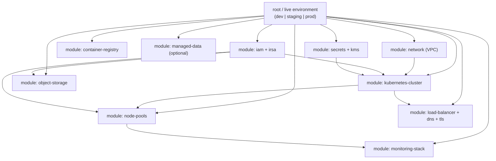
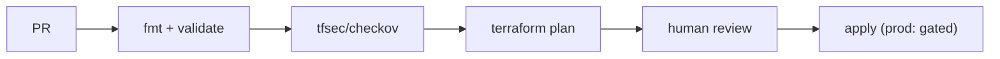
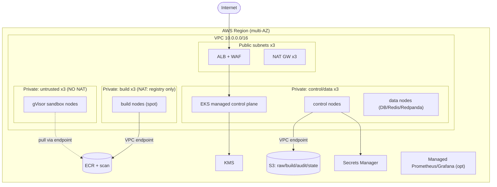

# Track 1 — Submission & Sandboxing Engine
## Deliverable 5: Terraform / Infrastructure-as-Code Design

> **Design only — no Terraform code in this document.** This specifies the modules,
> resources, inputs/outputs, dependency graph, state strategy, and security posture so an
> engineer (or Codex) can implement the `.tf` later without further architectural decisions.
> Written cloud-agnostic with an **AWS reference mapping** (GCP/Azure equivalents noted).

---

## 1. IaC Principles

1. **Everything reproducible.** The entire cloud footprint (network, cluster, storage, monitoring) is declared; `terraform apply` from zero yields a working platform — this is exactly the IaC deliverable the spec demands ("spun up, configured, and scaled").
2. **Modular & composable.** One root config wires together focused modules; each module is independently testable and reusable across `dev`/`staging`/`prod` via workspaces or `tfvars`.
3. **Remote, locked state.** State lives in a versioned object-store backend with a lock table — never local, never in git.
4. **Least-privilege provisioning identity.** The Terraform runner uses a scoped role; no static long-lived keys (OIDC from CI).
5. **Layered applies.** Bootstrap (state backend) → platform (network, cluster) → in-cluster (Helm/manifests). Cluster add-ons are managed by Terraform's Helm/Kubernetes providers **or** handed to GitOps (ArgoCD) — boundary defined below.
6. **Immutable, tagged, policy-checked.** All resources tagged (`project=iicpc-track1`, `env`, `owner`, `cost-center`); `tfsec`/`checkov` gate every plan.

---

## 2. Module Decomposition



### 2.1 Dependency order (apply graph)
`secrets/kms` + `iam` → `network` → `kubernetes-cluster` → `node-pools` → (`object-storage`, `container-registry`, `managed-data`) → `load-balancer/dns/tls` → `monitoring-stack` → in-cluster add-ons.

---

## 3. Module Specifications

### 3.1 `network` (VPC)

| Concern | Design | AWS | GCP/Azure |
|--------|--------|-----|-----------|
| **VPC** | One VPC per environment, /16 | `aws_vpc` | VPC network / VNet |
| **Subnets** | **Public** (LB/NAT) + **Private** (nodes) across ≥3 AZs | `aws_subnet` x6 | subnets x3 |
| **Egress** | NAT Gateway per AZ for **trusted** private subnets only | `aws_nat_gateway` | Cloud NAT |
| **Untrusted egress** | Untrusted node subnet has **no NAT route** (no internet) — reinforces D3 §2.7 | route table w/o NAT | no Cloud NAT route |
| **Endpoints** | Private endpoints for object store/registry so traffic stays on the backbone | `aws_vpc_endpoint` (S3, ECR) | Private Service Connect |
| **Flow logs** | VPC flow logs → object store (audit) | `aws_flow_log` | VPC Flow Logs |

**Inputs:** `cidr_block`, `az_count`, `enable_untrusted_isolated_subnet`.
**Outputs:** `vpc_id`, `private_subnet_ids`, `public_subnet_ids`, `untrusted_subnet_ids`.

**Subnet plan:**
```
10.0.0.0/16  VPC
 ├─ public      10.0.0.0/20   (LB, NAT, bastion-free)
 ├─ private-cp  10.0.16.0/20  (control + data nodes, NAT egress)
 ├─ private-build 10.0.32.0/20 (build nodes, NAT egress: registry/mirror only)
 └─ private-untrusted 10.0.48.0/20 (sandbox nodes, NO NAT — isolated)
```

### 3.2 `kubernetes-cluster`

| Concern | Design |
|--------|--------|
| **Control plane** | Managed K8s (EKS / GKE / AKS) — we don't self-host the API server |
| **Version** | Pinned; upgrades via Terraform-managed channel |
| **API access** | Private endpoint + allowlisted CIDRs; public access off (or tightly scoped) |
| **OIDC provider** | Enabled for workload identity (IRSA / Workload Identity) — pods get scoped cloud creds without static keys |
| **Encryption** | Secrets envelope-encrypted with KMS |
| **Audit logging** | API server audit logs → object store |
| **Add-on baseline** | CNI (Calico/Cilium for NetworkPolicy), CoreDNS, metrics-server |

**Inputs:** `vpc_id`, `private_subnet_ids`, `cluster_version`, `kms_key_arn`, `endpoint_allowlist`.
**Outputs:** `cluster_name`, `cluster_endpoint`, `oidc_provider_arn`, `kubeconfig`.

### 3.3 `node-pools`

Three pools mirroring D4 §1.1:

| Pool | Taint/Label | Capacity | Runtime prep |
|------|-------------|----------|--------------|
| `control` | `workload=control` | on-demand, fixed/auto | standard |
| `build` | `workload=build:NoSchedule` | autoscaled 0–N, **spot allowed** | rootless build tooling |
| `untrusted` | `workload=untrusted:NoSchedule`, `sandbox=true` | autoscaled 0–N, on-demand, **CPU-optimized** | **gVisor installed** + cgroups v2 + seccomp/AppArmor baseline (via custom AMI / launch template / node bootstrap) |

**Critical detail:** the untrusted pool's node image must ship **gVisor (`runsc` + containerd shim)**, cgroups v2 unified, swap disabled, and the AppArmor/seccomp profiles preloaded. This is a node-bootstrap concern Terraform wires via launch template/user-data or a managed node image. **Inputs:** `instance_types`, `min/max_size`, `runtime_class_install=true`, `labels`, `taints`.

### 3.4 `object-storage`

| Bucket | Purpose | Policy |
|--------|---------|--------|
| `raw-uploads` | contestant artifacts | versioned, SSE-KMS, **block public**, object-lock on audit copies, lifecycle TTL |
| `build-logs` | build output/logs | SSE-KMS, lifecycle TTL |
| `audit` | append-only audit | **WORM/object-lock (compliance mode)**, long retention |
| `tf-state` | Terraform backend | versioned, encrypted, locked (separate bootstrap) |
| `loki-chunks`, `backups` | logs, DB backups | SSE-KMS, lifecycle |

AWS `aws_s3_bucket` (+ public-access-block, versioning, lifecycle, object-lock); GCP GCS / Azure Blob equivalents.
**Inputs:** `bucket_prefix`, `kms_key_arn`, `retention_days`.
**Outputs:** bucket names/ARNs.

### 3.5 `container-registry`

- Managed OCI registry (ECR / Artifact Registry / ACR), **private**, with **scan-on-push** enabled and **immutable tags**.
- Lifecycle policy expires old submission images after the contest.
- IAM: build pool can **push**; untrusted pool can **pull** (scoped, read-only).
**Outputs:** `registry_url`, repo ARNs.

### 3.6 `managed-data` (optional vs in-cluster)

Two valid strategies — **decide once**, document in `tfvars`:

| Option | Postgres/Timescale | Redis | Kafka | Trade-off |
|--------|-------------------|-------|-------|-----------|
| **A. Managed** | RDS/Cloud SQL (+ Timescale on RDS or self-managed) | ElastiCache/Memorystore | MSK / Confluent / Redpanda Cloud | Less ops, more cost, fewer moving parts in-cluster |
| **B. In-cluster** | StatefulSets (D4 §5) | Redis StatefulSet | Redpanda StatefulSet | Full control, cheaper, more ops burden |

**Recommendation for the hackathon:** **Option B in-cluster** for self-contained reproducibility (one `terraform apply` + Helm stands everything up), with the module designed so swapping to managed is a variable flip. Provision via Terraform Helm provider or hand to ArgoCD (see §5).

### 3.7 `load-balancer + dns + tls`

- Cloud L7 load balancer fronting the Ingress controller (`aws_lb`/ALB or NLB; GLB; App Gateway).
- DNS zone + record for the public API (`api.track1.<domain>`).
- TLS certs via ACM / cert-manager + Let's Encrypt.
- WAF attached to the LB (rate-limiting, common-exploit rules) — the public edge from D1 §2.1.
**Outputs:** `api_dns_name`, `lb_arn`, `cert_arn`.

### 3.8 `iam` (+ IRSA / workload identity)

- Provisioning role for Terraform (scoped, OIDC-assumed from CI).
- **Per-service IRSA roles** mapping K8s ServiceAccounts → minimal cloud permissions:
  - `build-sa` → read one upload prefix + push to its registry repo.
  - `api-sa` → issue pre-signed URLs for `raw-uploads` only.
  - **untrusted node role → empty/none** (D3 §3.3: a compromised sandbox node yields no cloud creds).
- Enforce **IMDSv2** and block pod access to the node metadata endpoint.
**Outputs:** role ARNs keyed by service.

### 3.9 `secrets + kms`

- KMS CMK(s) for: object-store encryption, cluster-secret encryption, DB encryption.
- Secrets manager (AWS Secrets Manager / Vault) for DB creds, registry creds, signing keys (cosign), API JWT keys.
- Rotation policies.
**Outputs:** `kms_key_arn`, secret ARNs (referenced, never output in plaintext).

### 3.10 `monitoring-stack`

- In-cluster via Helm (kube-prometheus-stack: Prometheus, Grafana, Alertmanager; Loki for logs; optionally Tempo for traces).
- Persistent volumes for Prometheus; Loki backed by the `loki-chunks` bucket.
- Pre-baked dashboards/alerts: pipeline funnel, build success rate, sandbox OOM kills, admission denials, probe failures, quota saturation, Falco alerts.
- Optional managed alternative (CloudWatch / Managed Prometheus + Grafana) behind a variable.
**Inputs:** `storage_class`, `retention`, `alert_receivers`.

---

## 4. State, Environments & Workflow

| Aspect | Design |
|--------|--------|
| **Backend** | Object store (versioned, encrypted) + lock table (DynamoDB / GCS native lock) |
| **Bootstrap** | A tiny separate config provisions the state backend itself (chicken-and-egg) |
| **Environments** | `dev` / `staging` / `prod` via separate state keys + `tfvars` (not workspaces for prod isolation) |
| **Drift** | `terraform plan` in CI on schedule; alert on drift |
| **Policy** | `tfsec` + `checkov` + OPA `conftest` gate `plan` in CI |
| **Secrets in state** | Avoided; sensitive outputs marked `sensitive`, real secrets in the secrets manager |



---

## 5. Boundary: Terraform vs GitOps

| Layer | Owner | Why |
|-------|-------|-----|
| Cloud infra (VPC, cluster, pools, storage, IAM, KMS, LB/DNS) | **Terraform** | Slow-moving, security-critical, needs plan/review |
| Cluster add-ons (CNI policies, OPA/Kyverno, Falco, ingress, cert-manager, monitoring) | Terraform Helm provider **or** ArgoCD | Either works; pick one and stay consistent |
| Track 1 app workloads (API, Deployment Mgr, sandboxes) | **App CD pipeline / ArgoCD** (K8s manifests, not Terraform) | Fast-moving app deploys shouldn't churn infra state |

**Recommendation:** Terraform for everything up to and including platform add-ons; **ArgoCD** for the Track 1 application manifests. Keeps infra and app lifecycles cleanly separated.

---

## 6. Cloud Footprint Diagram (AWS reference)



GCP mapping: VPC↔VPC, EKS↔GKE, ALB↔Global LB, S3↔GCS, ECR↔Artifact Registry, KMS↔Cloud KMS, Secrets Manager↔Secret Manager, NAT↔Cloud NAT, IRSA↔Workload Identity.

---

## 7. Outputs Consumed by Deployment (handoff to D4/D7)

The IaC layer must output (for the app/GitOps layer to consume):
`cluster_name`, `cluster_endpoint`, `oidc_provider_arn`, `registry_url`, bucket names, `kms_key_arn`, IRSA role ARNs per ServiceAccount, `api_dns_name`, `storage_class_name`, untrusted/build node-pool labels & taints. These become the variables the Kubernetes manifests (D4) and CODING_PLAN (D7) reference.

---

*Next: Deliverable 6 (Implementation Roadmap) sequences all of this into five phases with complexity, dependencies, and testing strategy.*
