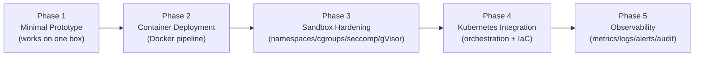

# Track 1 — Submission & Sandboxing Engine
## Deliverable 6: Implementation Roadmap

> A phased, dependency-ordered plan to build the system designed in D1–D5. Each phase is
> independently demoable, adds one layer of capability or hardening, and has an explicit
> **complexity estimate, dependencies, exit criteria, and testing strategy**.
> Sequencing principle: **make it work → containerize it → make it safe → make it scale → make it observable.**

---

## 0. Roadmap at a Glance

| Phase | Theme | Complexity | Risk | Demo at end |
|-------|-------|-----------|------|-------------|
| 1 | Minimal prototype | **M** | low | Upload → build → run → hit endpoint, locally |
| 2 | Container deployment | **M** | medium | Submission runs in a Docker container with limits |
| 3 | Sandbox hardening | **XL** | **high** | Malicious sample is contained; escape attempts fail |
| 4 | Kubernetes integration | **XL** | high | One `apply` → cluster runs many sandboxes, autoscaled |
| 5 | Observability | **L** | medium | Live dashboards, alerts, audit trail, Track 3 feed |

Complexity legend: S < M < L < XL (relative effort, not time).

---

## Phase 1 — Minimal Prototype ("make it work")

**Goal:** prove the end-to-end pipeline on a single machine with **no isolation yet** — the skeleton everything else hardens.

**Scope / deliverables**
- Submission API (REST): `POST /submissions`, `GET /submissions/{id}`, upload endpoint.
- Metadata persistence: `submissions`, `builds`, `deployments` tables (schema from D1).
- Build Service: compile a C++ submission with a fixed toolchain into a binary.
- Local "deploy": run the built binary as a child process, capture its declared port.
- Health check: TCP/HTTP probe; mark `READY`.
- Submission **state machine** (D1) driven by an in-process event bus (can be a queue/table first).

**Explicitly NOT in scope:** containers, isolation, K8s, multi-language, real security.

| Aspect | Detail |
|--------|--------|
| **Complexity** | **M** — mostly plumbing + state machine correctness |
| **Dependencies** | Postgres; a language toolchain; the D1 schema & state machine |
| **Key risks** | State-machine edge cases; build-error surfacing |
| **Exit criteria** | A C++ submission goes `CREATED→…→READY`; client curls the running endpoint; failures land in `BUILD_FAILED` cleanly |

**Testing strategy**
- *Unit:* state-machine transitions (valid/invalid), API validation, build-result parsing.
- *Integration:* real upload → build → run → probe against a known-good sample app; a deliberately broken sample to assert `BUILD_FAILED`.
- *Fixtures:* a tiny "echo server" submission in C++ as the golden sample.

---

## Phase 2 — Container Deployment ("containerize it")

**Goal:** every submission runs **inside a Docker/OCI container** with basic resource limits, built from an immutable image.

**Scope / deliverables**
- Build Service emits an **OCI image** per submission (multi-stage: build → minimal runtime), pushed to a registry.
- Per-language **base images** (C++, Rust, Go) — the spec's three languages.
- Container Orchestrator (local Docker first): run image with `--cpus`, `--memory`, `--pids-limit`, restart policy off.
- Read-only rootfs + tmpfs scratch; non-root user in image.
- Endpoint exposure via container port mapping; health probe against the container.
- Image digest recorded in `builds`/`deployments`.

| Aspect | Detail |
|--------|--------|
| **Complexity** | **M** — Dockerfile design + registry wiring |
| **Dependencies** | Phase 1; a container runtime; a registry (local/managed); base images |
| **Key risks** | Build reproducibility; image bloat; multi-language toolchains |
| **Exit criteria** | All three languages build to images and run with enforced CPU/memory caps; OOM/over-CPU submissions are throttled/killed predictably |

**Testing strategy**
- *Unit:* Dockerfile-render logic, resource-flag mapping, registry push/pull wrappers.
- *Integration:* build+run each language sample; assert memory cap (allocate-too-much → OOM-killed), CPU cap (busy loop → throttled, not starving host).
- *Reproducibility:* same input → same image digest (pinned bases, locked deps).

---

## Phase 3 — Sandbox Hardening ("make it safe")  ⚠ highest-value phase

**Goal:** turn the container into a genuine **security sandbox** that resists malicious contestant code (the core differentiator and the spec's central requirement).

**Scope / deliverables (layered, each independently testable)**
1. **Namespaces** — PID/net/mnt/IPC/UTS/user/cgroup; rootless (userns remap).
2. **cgroups v2** — `cpu.max`, **`cpuset.cpus` (CPU pinning)**, `memory.max` (+ `swap.max=0`), `pids.max`, `io.max`.
3. **Capabilities** — drop ALL; `no_new_privs`.
4. **seccomp-BPF** — deny-by-default syscall allowlist per language.
5. **AppArmor** (or SELinux) — mandatory-access-control profile.
6. **Filesystem** — read-only rootfs, `noexec,nosuid,nodev` tmpfs scratch, no host mounts.
7. **gVisor (`runsc`)** — userspace kernel as the default runtime for untrusted pods; **Kata/microVM** option behind a flag.
8. **Network isolation** — default-deny; block link-local metadata (`169.254.169.254`).

(Implements D3 §3 mechanism-by-mechanism.)

| Aspect | Detail |
|--------|--------|
| **Complexity** | **XL** — deepest OS/security work; profile tuning is iterative |
| **Dependencies** | Phase 2; host with cgroups v2, gVisor, AppArmor; D3 threat catalog |
| **Key risks** | seccomp/AppArmor false-positives breaking legit code; gVisor perf overhead; profile maintenance per language |
| **Exit criteria** | A curated **malicious test suite** is fully contained: no host FS access, no raw network, no privilege escalation, no fork-bomb survival, no metadata-endpoint reach, CPU/mem strictly bounded |

**Testing strategy**
- *Red-team corpus (the crown jewels):* fork bomb, `/proc`/`/sys` snoopers, host-mount escape attempts, raw-socket/port-scan, reverse shell to metadata IP, memory bomb, CPU hog, crypto-miner pattern, syscall-fuzzer. Each must be **blocked or contained** — assert via expected denials/kills.
- *Compatibility:* legit samples in all three languages still build/run under full hardening (catch over-restrictive seccomp/AppArmor).
- *Resource fairness:* two co-located sandboxes can't steal each other's pinned cores (measure with the Track 2 Bot Fleet load).
- *Regression gate:* the red-team corpus runs in CI; a single escape = build fails.

---

## Phase 4 — Kubernetes Integration ("make it scale")

**Goal:** lift the hardened sandbox into the cluster designed in D4, provisioned by the IaC in D5 — many submissions, scheduled, isolated by node pool, autoscaled.

**Scope / deliverables**
- Deployment Manager creates **Sandbox Pods + Services + NetworkPolicies** (D4 §4) via the K8s API.
- `RuntimeClass=gvisor`, untrusted **node pool** with taints/tolerations + nodeSelector.
- `ResourceQuota`/`LimitRange`, `Guaranteed` QoS with integer CPU (pinning) at pod scope.
- Build pipeline → **Jobs** in `track1-build` with TTL.
- Admission policy (OPA/Kyverno): reject pods lacking the hardened profile.
- **Terraform** stands up VPC, cluster, three node pools, object storage, registry, LB/DNS, KMS/IAM (D5).
- Deregister-first teardown; reconciliation loop.

| Aspect | Detail |
|--------|--------|
| **Complexity** | **XL** — distributed lifecycle + IaC + admission control |
| **Dependencies** | Phase 3; D4 infra design; D5 IaC design; a cloud account |
| **Key risks** | Scheduling correctness (untrusted never on control nodes); pinning at scale; quota exhaustion; teardown/registry consistency |
| **Exit criteria** | `terraform apply` from zero → working cluster; N concurrent sandboxes scheduled only on untrusted nodes; autoscaler adds/removes nodes; admission blocks a non-hardened pod; quota makes excess submissions queue (not crash) |

**Testing strategy**
- *Unit:* pod/Service/NetworkPolicy spec generators; reconciliation logic (mock API).
- *Integration (kind/k3s/ephemeral cluster):* deploy a sandbox, assert it lands on a tainted node, has the right runtimeClass, RO rootfs, default-deny netpol; assert teardown removes Pod+Service+registry entry.
- *Admission:* submit a privileged/incomplete pod → rejected.
- *Scale/soak:* ramp many sandboxes under Bot-Fleet load; verify pinning isolation and autoscaling; chaos-kill an untrusted node → reconciler recovers.
- *IaC:* `terraform plan` clean + idempotent; `tfsec`/`checkov` pass; destroy/recreate dev env.

---

## Phase 5 — Observability ("see everything")

**Goal:** full visibility, alerting, and audit; feed Track 3 (Telemetry Ingester).

**Scope / deliverables**
- **Metrics:** per-stage pipeline funnel, build success/latency, sandbox CPU/mem/OOM, probe failures, quota saturation, admission denials → Prometheus.
- **Logs:** structured logs (build, deploy, health, audit) → Loki; **immutable audit log** to WORM storage (D3 §6).
- **Tracing (optional):** submission_id correlation across services.
- **Runtime security:** Falco alerts on suspicious syscalls inside sandboxes.
- **Dashboards + alerts:** Grafana boards; Alertmanager routes (OOM spikes, escape-attempt signatures, queue backlog, node pressure).
- **Track 3 handoff:** emit submission/endpoint health + resource metrics to the platform telemetry bus (Kafka/Redpanda) the spec describes.

| Aspect | Detail |
|--------|--------|
| **Complexity** | **L** — mostly integration + dashboarding |
| **Dependencies** | Phases 1–4 (instrumentation hooks added as you go); monitoring stack from D5 |
| **Key risks** | Cardinality blow-up; alert fatigue; audit-log gaps |
| **Exit criteria** | Live dashboards for the full funnel; alerts fire on injected faults (OOM, escape signature, backlog); tamper-evident audit trail; Track 3 receives the metric stream |

**Testing strategy**
- *Unit:* metric/label emission, log schema validation, audit-record completeness.
- *Integration:* inject faults (force OOM, trip a Falco rule, stall the queue) → assert the right alert fires and the dashboard reflects it.
- *Audit:* attempt to mutate an audit record → blocked/detected; every state transition has a corresponding immutable entry.
- *E2E:* a submission's full journey is reconstructable from telemetry by `submission_id`.

---

## 1. Cross-Phase Concerns (built incrementally, not bolted on)

| Concern | P1 | P2 | P3 | P4 | P5 |
|---------|----|----|----|----|----|
| State machine & events | ◑ build | ● | ● | ● | ● |
| AuthN/Z on API | basic | basic | ● | ● | ● |
| Security hardening | — | basic limits | ● core | ● admission | ● runtime detect |
| IaC (Terraform) | — | — | — | ● | ● monitoring |
| CI red-team gate | — | — | ● add | ● enforce | ● |

`●` primary work, `◑` partial. Security and testing are **continuous**, not a final phase.

---

## 2. Recommended Build Order Within Each Phase
1. Define/confirm the data contracts (API, schema, events) for the phase — from D1/D7.
2. Implement the happy path + state transitions.
3. Add failure handling and the phase's exit-criteria tests.
4. Wire telemetry hooks (even before Phase 5, emit structured logs/metrics).
5. Demo against the phase exit criteria before moving on.

---

## 3. Suggested MVP Cut (if time-boxed)
**Phases 1–3 single-node** is a credible, *secure* demo: real upload→build→containerized→**hardened** sandbox with a malicious-code containment proof. Phases 4–5 turn it into a scalable platform. Never ship Phase 2 without at least starting Phase 3 — **an unhardened public code-execution service is the single biggest risk** (D3).

---

*Next: Deliverable 7 (CODING_PLAN.md) turns this roadmap into a precise, agent-implementable spec — folder structures, API contracts, schemas, events, and per-service interfaces.*
