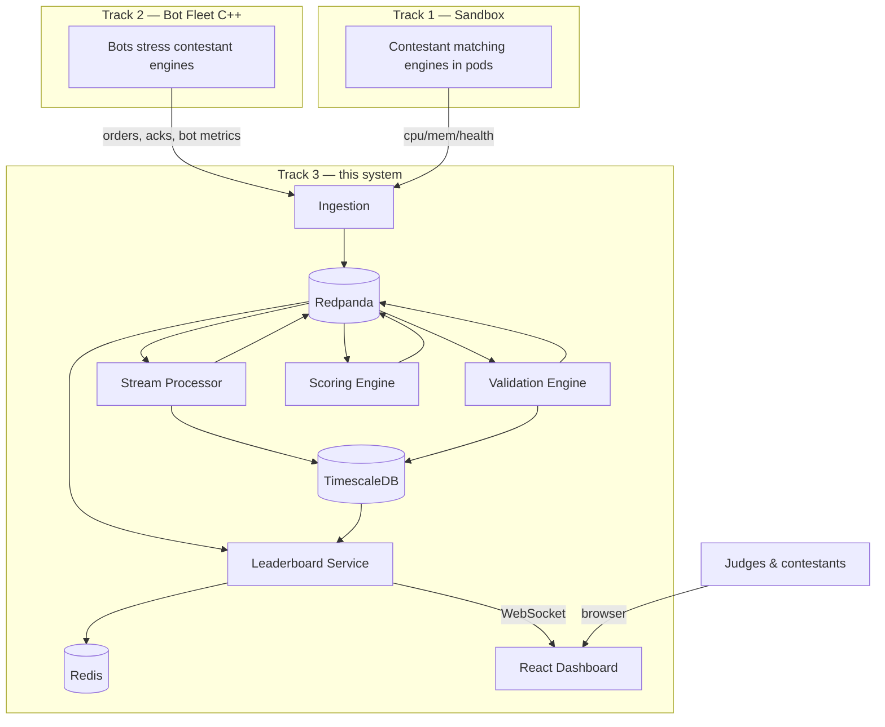
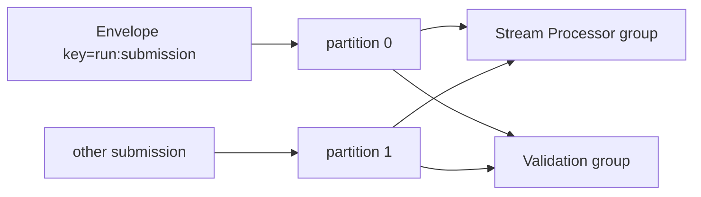

# Track 3 Architecture

A single-page reference for how the Telemetry, Validation, Analytics &
Leaderboard system fits together. For intuition read
[../TRACK3_EXPLAINED.md](../TRACK3_EXPLAINED.md); for the build contract read
[../CODING_PLAN.md](../CODING_PLAN.md).

---

## 1. System context

## 2. Why each technology

| Concern | Choice | Why |
|---------|--------|-----|
| Event bus | **Redpanda** | Kafka API with no JVM/ZooKeeper; single binary; low latency; matches Track 1 |
| Services | **Go 1.22** | cheap goroutine concurrency, fast startup, static binaries, great Kafka/pgx/Redis libs |
| History store | **TimescaleDB** | hypertables + retention for time-series window rows; still plain SQL; degrades to Postgres |
| Live ranking | **Redis ZSET** | O(log n) ranked updates, millisecond top-N reads, durable mirror for restart |
| Live push | **WebSocket** | server-initiated, persistent, low overhead vs per-second polling |
| Percentiles | **HDR histogram** | bounded-error p99 at scale; mergeable because layout matches Track 2 exactly |
| Dashboard | **React + TS + Vite** | requested; component model fits live, filterable tables |
| Metrics | **Prometheus + Grafana** | standard scrape/visualize; every service exposes `:9100` |

## 3. Data flow & ordering

Every event is an **Envelope** keyed by `run_id:submission_id`. That key pins all
of a submission's events to one Redpanda partition, giving the **per-partition
ordering** the order-book replay needs. Topics: `track3.orders`,
`track3.bot-metrics`, `track3.sandbox-metrics`, `track3.window-aggregates`,
`track3.validation-result`, `track3.scores`, `track3.dead-letter`.

- **Stream processor & validation** use *shared* consumer groups → partitions are
  divided across replicas (horizontal scale), each event processed once.
- **Leaderboard** uses a *unique* group per replica → every replica gets the full
  score stream and can serve any client; Redis is the shared source of truth.

## 4. Concurrency model

Within the stream processor and validation engine, consumer goroutines only
**decode + forward** onto a channel; one **event-loop goroutine owns all
per-submission state**, so the hot path is lock-free (the same per-shard design
Track 2 uses). Per-submission state lives in a `map[(run,submission)]`.

## 5. Windowing & percentiles

One ring of fixed 1 s slots backs three window kinds: **tumbling** (official
per-interval record → DB), **sliding** (smooth live charts), **rolling**
(stability + current score). Each slot carries an HDR histogram; windows are
slot **merges**, so `Record` is O(1) and a query is O(#slots). Identical HDR
layout `[1 µs, 10 s] @ 3 sig digits` makes cross-shard merges lossless and keeps
Track 3's p99 equal to Track 2's.

## 6. Scoring

`composite = gate(correctness) × (0.35·Latency + 0.30·Throughput + 0.25·Correctness + 0.10·Stability)`,
each sub-score in [0,100]. Latency is log-scaled p99 (best 100 µs → worst
50 000 µs); throughput saturates at 100k TPS; stability penalizes TPS coefficient
of variation and error rate; the gate crushes the score if correctness < 0.5, so
**fast-but-wrong cannot win**. Scores are absolute (fixed reference points), so
they are stable as the field changes.

## 7. Storage model

| Store | Holds | Access |
|-------|-------|--------|
| TimescaleDB | `runs`, `submissions_meta`, `window_aggregates` (hypertable), `rolling_stats`, `validation_results`, `scores` | history, charts, audit |
| Redis | ZSET `lb:<run>:scores` + per-entry JSON mirror (24 h TTL) + run set | live ranking, fast top-N, restart rehydrate |
| In-memory | per-(run,submission) aggregators & boards | hot path |

## 8. Failure & resilience

- Bad/hostile input fails `Envelope.Validate()` at ingestion and is **dead-lettered**, never poisoning the pipeline.
- The bus retains events; consumers resume from committed offsets after a crash.
- Leaderboard replicas rebuild from Redis via `Hydrate()` on startup.
- Persistence is optional (`POSTGRES_DSN` empty) — the live pipeline still runs.
- Slow WebSocket clients have bounded buffers and are dropped, never stalling the broadcast.

## 9. Deployment topology

`docker-compose.yml` for local/demo; `infra/k8s` (StatefulSets for Redpanda/
Postgres/Redis, Deployments + HPAs for the five Go services, Ingress) and
`infra/helm/track3` for clusters. Backend images come from one `ARG SERVICE`
Dockerfile building into a distroless nonroot base. Observability via
`dashboards/` (Prometheus scrape + Grafana provisioning).
